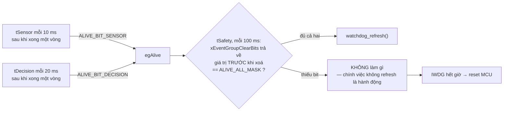

# Trạng thái hiện thực hóa — checklist

[Về mục lục](README.md) · [Vai trò firmware](FIRMWARE_GUIDE.md) · [Hướng dẫn triển khai](IMPLEMENTATION_GUIDE.md) · [Kiểm thử](TEST_PLAN.md) · [Sơ đồ Mermaid](../docs/diagrams/)

**Nguồn:** quét toàn bộ `Firmware/` (trừ `ThirdParty/`) tìm `STATUS_NOT_READY`, `IMPLEMENT`, `TO DO`.
File này mô tả **trạng thái mã nguồn**, không phải hành vi đã đo trên xe.
Cập nhật mỗi khi một mục được hiện thực hóa và kiểm chứng.

---

## 1. Phát hiện chính

**Lớp App đã xong, không phải stub.** `obstacle_avoidance.c`, `safety_monitor.c` và
`robot_car.c` đều có logic đầy đủ. Toàn bộ phần thiếu nằm ở **MCAL + Devices + thân
5 task**. Luồng tránh vật cản bị chặn bởi đúng bốn chuỗi đứt:

```text
SENSING (range)   timebase_capture_us ✗ → ultrasonic_read ✗ → sensor_manager_update ✗ → qRangeMailbox
SENSING (imu)     i2c_read ✗ → mpu6050_read ✗ → sensor_manager_update ✗ → qImuMailbox
ACTUATION         pwm_write ✗ → motor_apply ✗ → TB6612
ORCHESTRATION     task_safety / task_sensor / task_decision ✗ (chỉ vTaskDelay)
```

### Ràng buộc then chốt: không thể bỏ qua MPU6050

`safety_update()` set `SAFETY_BIT_SENSOR_FAULT` khi `!range_ok || !imu_ok`, và bit đó
chỉ được xoá lúc rearm nếu **cả hai** mẫu hợp lệ:

```c
if (range_ok && imu_ok) { clear |= SAFETY_BIT_SENSOR_FAULT; }
```

Nghĩa là **thiếu IMU thì `safety_is_clear_to_run()` vĩnh viễn `false`**, `motor_apply()`
vĩnh viễn trả `NOT_READY`, và FSM không bao giờ rời `CAR_IDLE`. I2C + MPU6050 nằm trên
đường găng, không phải việc phụ. Không có đường tắt "chạy thử chỉ với siêu âm".

---

## 2. Danh sách file thiếu logic

### 2.1 Stub hoàn toàn — mọi hàm trả `NOT_READY`

| File | Hàm | Chặn cái gì | Bước |
| --- | --- | --- | --- |
| `Drivers/MCAL/Src/pwm.c` | `pwm_init` `pwm_write` `pwm_stop` | motor | 4 |
| `Drivers/MCAL/Src/i2c.c` | `i2c_init` `i2c_read` `i2c_write` | IMU → safety | 3 |
| `Drivers/MCAL/Src/exti.c` | `exti_init` `exti_read_pending` `exti_irq_capture` | *(không chặn — button dùng polling)* | 5 |
| `Drivers/Devices/Src/ultrasonic_hcsr04.c` | `ultrasonic_init` `_request` `_read` | khoảng cách | 2 |
| `Drivers/Devices/Src/mpu6050.c` | `mpu6050_init` `_read` `_calibrate` | tilt + xoá `SENSOR_FAULT` | 3 |
| `Drivers/Devices/Src/buzzer.c` | `buzzer_init` `_set` `_update` | *(không chặn)* | 5 |

### 2.2 Stub một phần

| File | Hàm hỏng | Hàm đã chạy được | Bước |
| --- | --- | --- | --- |
| `Drivers/MCAL/Src/timebase.c` | **`timebase_capture_us`** — TIM2 cố tình chưa init | `timebase_init` ✅ · `timebase_now_ms` ✅ (`HAL_GetTick`) | 2 |
| `Drivers/Devices/Src/motor_tb6612.c` | **`motor_init`** · **`motor_apply`** — luôn `NOT_READY`, không bao giờ bật bridge | validate tham số ✅ · gọi safety predicate ✅ · `gpio_emergency_stop` ✅ | 4 |
| `App/Src/sensor_manager.c` | **`sensor_manager_update`** — mailbox vĩnh viễn `SAMPLE_NOT_READY` | `_init` ✅ · `_get_latest` ✅ | 2–3 |
| `Drivers/MCAL/Src/uart_debug.c` | `uart_debug_read` | `_init` `_write` `uart_log` `uart_log_u32` ✅ | 5 |
| `Core/Src/main.c` | **5 thân task** chỉ `vTaskDelay(100 ms)` | boot · clock 72 MHz · tạo task static ✅ | 1 |
| `Core/Src/stm32f1xx_it.c` | 49 × `UNIMPLEMENTED_IRQ` → `configASSERT(0)` | SysTick wrapper ✅ | 0 |

### 2.3 Đã có logic thật — không cần làm lại

`App/Src/obstacle_avoidance.c` · `App/Src/safety_monitor.c` · `App/Src/robot_car.c` ·
`Drivers/Devices/Src/button.c` · `Drivers/Devices/Src/status_led.c` · `Drivers/MCAL/Src/gpio.c`

---

## 3. Checklist theo bước

Nguyên tắc: **actuation làm sau cùng**; mỗi bước phải tự kiểm chứng được bằng UART
trước khi sang bước kế.

### Bước 0 — Mở đường build ✅ ĐÃ XONG

- [x] `Core/Inc/stm32f1xx_hal_conf.h`: bật `HAL_TIM_MODULE_ENABLED`, `HAL_I2C_MODULE_ENABLED`
- [x] `Firmware/CMakeLists.txt`: thêm `stm32f1xx_hal_tim.c`, `_tim_ex.c`, `_i2c.c`
- [x] `Core/Src/stm32f1xx_it.c`: định tuyến `TIM2_IRQHandler`, `I2C1_EV_IRQHandler`,
      `I2C1_ER_IRQHandler` về module chủ sở hữu thay vì `configASSERT(0)`
- [x] `timebase.h` / `i2c.h`: thêm điểm vào ISR (`timebase_irq_capture`,
      `i2c_irq_event`, `i2c_irq_error`) theo đúng mẫu `exti_irq_capture` có sẵn

> **Vì sao phải làm trước:** bật ngắt ngoại vi khi handler còn là
> `UNIMPLEMENTED_IRQ` thì ngắt đầu tiên rơi vào `configASSERT(0)` và treo máy.
> Định tuyến trước, bật NVIC sau.

### Bước 1 — Nối thân 5 task ✅ ĐÃ XONG

- [x] `task_safety` → `safety_update()`, chu kỳ **10 ms** (`SAFETY_TARGET_PERIOD_MS`)
- [x] `task_sensor` → `sensor_manager_update()`, chu kỳ **10 ms** (`SENSOR_IMU_PERIOD_MS`, deadline range 60 ms do chính module giữ)
- [x] `task_decision` → `robot_car_update()`, chu kỳ **20 ms** (`DECISION_TARGET_PERIOD_MS`)
- [x] `task_log` → in `egSafety` khi đổi + heartbeat 1 s
- [x] `task_buzzer` → `buzzer_update()`, chu kỳ 100 ms
- [x] Cả 5 task dùng `xTaskDelayUntil` thay `vTaskDelay`

#### Kết quả build sau bước 0 + 1

| Bản | Flash | RAM | So với baseline `cc83423` |
| --- | --- | --- | --- |
| Debug | 16 240 B (**24,78 %**) | 8 576 B (**41,88 %**) | Flash **+2 116 B**, RAM **+32 B** |
| Release | 14 016 B (**21,39 %**) | 8 576 B (**41,88 %**) | Flash **+1 560 B** |

`bash tools/check_constraints.sh build/debug/obstacle_car.elf` → **Tất cả đạt**
(không `HAL_Delay`, không `printf`, không cấp phát động, ELF sạch, không `heap_*.c`).
Không warning nào từ mã dự án với `-Wall -Wextra -Wpedantic -Wshadow -Wdouble-promotion`.

**Flash tăng chủ yếu không phải do bật HAL TIM/I2C** (chưa hàm nào gọi tới nên
`--gc-sections` vẫn cắt bỏ). Nguyên nhân là các hàm App/Devices trước đây **không ai
gọi nên bị loại khỏi ELF** — đúng như ghi chú ở `BUILD_VERIFICATION.md` §Kiểm tra
liên kết. Sau bước 1 chúng đã vào ảnh: `safety_update`, `sensor_manager_update`,
`robot_car_update`, `obstacle_avoidance_update`, `motor_apply`, `status_led_set`,
`button_read`, `buzzer_update`, `uart_log_u32`.

Xác minh định tuyến IRQ bằng `objdump`:

```text
080004ae <TIM2_IRQHandler>:    bl 8000938 <timebase_irq_capture>
080004b6 <I2C1_EV_IRQHandler>: bl 800098c <i2c_irq_event>
080004be <I2C1_ER_IRQHandler>: bl 8000994 <i2c_irq_error>
```

#### Kiểm chứng trên board — CHƯA CHẠY

Chưa nạp lên phần cứng. Kỳ vọng khi nạp:

- LED PC13 nháy theo `LED_IDLE` — sáng 60 ms mỗi chu kỳ 1 s.
- UART in `safety=3` (`SAFETY_BIT_STOP | SAFETY_BIT_SENSOR_FAULT`, chốt từ lúc boot),
  `range_st=4` và `imu_st=4` (`SAMPLE_NOT_READY`).
- Nhấn nút → rearm **thất bại** vì chưa có mẫu hợp lệ; `SENSOR_FAULT` vẫn còn,
  `safety=` đổi từ 3 xuống 2 rồi giữ nguyên.
- **Xe đứng yên. Đây là kết quả đúng, không phải lỗi** — `motor_apply()` vẫn luôn
  trả `NOT_READY` và `gpio_emergency_stop()` chạy vô điều kiện mỗi 20 ms.

### Bước 2 — Chuỗi đo khoảng cách ✅ CODE XONG, CHƯA ĐO TRÊN BOARD

- [x] `timebase.c` — TIM2 **PWM Input Mode**: TI1 (PA0) nối nội bộ tới cả IC1 (cạnh lên,
      reset bộ đếm qua slave mode) và IC2 (cạnh xuống → `CCR2` = độ rộng xung)
- [x] Xử lý tràn bộ đếm: **`URS = 1`** để chỉ tràn thật mới sinh ngắt update
- [x] `timebase_capture_us()` **non-blocking** — trả `NOT_READY` khi đang đo
- [x] `ultrasonic_hcsr04.c` — xung Trig 10 µs trên PA1, chống chồng lấn, tôn trọng
      `SENSOR_RANGE_PERIOD_MS = 60`, `ECHO_TIMEOUT_US = 30000` → `SAMPLE_TIMEOUT`
- [x] `sensor_manager.c :: sensor_manager_update()` — publish vào `qRangeMailbox`,
      timestamp là **thời điểm phát Trig**
- [x] `main.c :: task_log` — in `range_mm=` và `range_age_ms=` khi mẫu hợp lệ
- [ ] **Kiểm chứng trên board** — CHƯA CHẠY

#### Quyết định thiết kế

**PWM Input Mode thay vì EXTI hai cạnh.** Phần cứng đo và chốt độ rộng xung, nên độ trễ
ISR và jitter của scheduler **không thể** làm sai phép đo. EXTI chỉ báo có cạnh; thời
điểm đọc bộ đếm lại phụ thuộc lúc ISR chạy.

**`URS = 1` là bắt buộc.** Slave mode Reset cũng sinh update event mỗi lần nó reset bộ
đếm — tức mỗi cạnh lên của Echo. Không đặt `URS` thì ISR hiểu nhầm mọi cạnh lên thành
tràn bộ đếm và **mọi phép đo đều thất bại**. Lỗi này không treo máy nên rất khó thấy.

**Hai lớp deadline độc lập:** phần cứng tràn bộ đếm ở 65 536 µs; phần mềm so `HAL_GetTick`
với 30 ms. Mất cạnh xuống thì lớp cứng bắt; treo cả ISR thì lớp mềm vẫn bắt.

#### Thay đổi API — cần review chung

Thêm **`timebase_capture_arm()`** vào `timebase.h`. Không có nó,
`timebase_capture_us()` không phân biệt được kết quả mới với kết quả còn sót của lần đo
trước. Đây là API dùng chung giữa MCAL và Devices, `CLAUDE.md` yêu cầu review chung.

#### Busy-wait 10 µs — có chủ đích

Xung Trig 10 µs là **yêu cầu của datasheet**, không phải chờ sự kiện. Đo bằng chính bộ
đếm 1 µs/tick của TIM2 nên không đổi theo mức tối ưu của trình biên dịch. Gọi mỗi 60 ms
trong `tSensor` (priority 2) ⇒ **0,017 % CPU**, trễ tối đa gây cho `tSafety` là 10 µs
trên chu kỳ 10 ms. Muốn bỏ hẳn: dùng **TIM4 (đang trống)** ở One-Pulse Mode — nhưng đó
là quyết định về quyền sở hữu timer, phải chốt trong `board_config.h` trước.

#### Kết quả build sau bước 2

| Bản | Flash | RAM | So với bước 0+1 |
| --- | --- | --- | --- |
| Debug | 19 260 B (**29,39 %**) | 8 680 B (**42,38 %**) | Flash +3 020 B, RAM +104 B |
| Release | 16 416 B (**25,05 %**) | 8 672 B (**42,34 %**) | Flash +2 400 B |

`check_constraints.sh` → **Tất cả đạt**. Không warning từ mã dự án.

Stack usage đo bằng `-fstack-usage` (file `.su`) — chuỗi sâu nhất của `tSensor`:

```text
task_sensor 16 + sensor_manager_update 24 + ultrasonic_read 16 + timebase_capture_us 16 = 72 B
timebase_irq_capture = 0 B   (ISR lá, không có khung stack riêng)
timebase_init        = 80 B  (chạy trước scheduler, trên MSP)
```

Stack mỗi task là 1 024 B ⇒ biên rất rộng. Vẫn phải đo
`uxTaskGetStackHighWaterMark()` trên board, con số tĩnh không thay thế được.

#### Kiểm chứng trên board — CHƯA CHẠY

1. **Trước khi cắm Echo:** đo bằng đồng hồ rằng điện áp vào PA0 ≤ 3,3 V.
   **PA0 không phải chân 5V-tolerant.**
2. Đặt vật cản ở 100 / 300 / 1000 mm, so `range_mm=` với thước — sai số kỳ vọng ±10 mm.
3. Che kín cảm biến hoặc rút dây Echo → `range_st=2` (`SAMPLE_TIMEOUT`) trong vòng
   ~31 ms, **không treo**, `range_mm=` không được in.
4. Đưa vật cản sát < 20 mm → `range_st=0` (`SAMPLE_OK`) với `range_mm=20` — giá trị bị
   **kẹp**, không báo lỗi (xem dưới).
5. `range_age_ms=` phải dao động trong khoảng 0–70 ms; vượt `SENSOR_STALE_MS = 200`
   nghĩa là chuỗi đo đang kẹt.

#### Chính sách giá trị ngoài dải — đã chốt

Chỉ **mất xung Echo** hoặc **quá `ECHO_TIMEOUT_US` (30 ms)** mới là thất bại của phép đo.
Một kết quả nằm ngoài dải datasheet vẫn là **bằng chứng có thật** về khoảng cách, chỉ là
không chính xác — nên nó bị **kẹp** chứ không bị báo lỗi:

| Đo được | Báo ra | Hướng lệch | Hệ quả ở FSM |
| --- | --- | --- | --- |
| `< 20 mm` | `20 mm`, `SAMPLE_OK` | — | dưới `D_STOP_MM` → `CAR_STOP` → quay né |
| `20..4000 mm` | giữ nguyên, `SAMPLE_OK` | — | bình thường |
| `> 4000 mm` | `4000 mm`, `SAMPLE_OK` | **gần hơn** thực tế | không bao giờ tạo ra "đường trống" giả |
| mất echo / > 30 ms | `0 mm`, `SAMPLE_TIMEOUT` | — | `range_valid = false` → `CAR_FAULT` |

Kẹp cận dưới thay vì báo `SAMPLE_ERROR` vì báo lỗi sẽ đẩy xe vào `CAR_FAULT` — dừng hẳn
và phải rearm bằng tay — quá nặng cho tình huống "vật cản rất sát" mà đáng lẽ chỉ cần né.

> ⚠️ `SAMPLE_TIMEOUT` **tuyệt đối không** được quy về `0 mm` hay một khoảng cách rất xa
> **rồi dùng như phép đo hợp lệ**. Hiện tại `value = 0` đi kèm `status = SAMPLE_TIMEOUT`;
> consumer bắt buộc đọc `status` trước, và `safety_monitor` coi mọi status khác
> `SAMPLE_OK` là fault.
>
> ⚠️ Xe vẫn **không chạy** sau bước này: thiếu IMU nên `SAFETY_BIT_SENSOR_FAULT` chưa
> xoá được. Đúng thiết kế — xem §1.

### Bước 3 — IMU ✅ CODE XONG, CHƯA ĐO TRÊN BOARD

- [x] `i2c.c` — I2C1 400 kHz (`IMU_I2C_SPEED_HZ` mới trong `board_config.h`),
      transaction có timeout `I2C_TIMEOUT_MS = 10`
- [x] **Stuck-bus recovery** — phát tối đa 9 xung SCL khi SDA kẹt thấp, rồi phát STOP
- [x] `mpu6050.c` — `WHO_AM_I == 0x68`, đánh thức + DLPF 44 Hz + 125 Hz + ±250 °/s + ±2 g,
      burst read 14 byte, timestamp lúc bắt đầu giao dịch
- [x] `mpu6050_calibrate()` — ước lượng bias gyro, **từ chối nếu phát hiện chuyển động**
- [x] `sensor_manager.c` — nhánh IMU ở nhịp `SENSOR_IMU_PERIOD_MS = 10`, tự khởi tạo lại
      mỗi 500 ms khi driver báo chưa sẵn sàng
- [ ] **Kiểm chứng trên board** — CHƯA CHẠY

#### Tilt nằm ở đâu — và vì sao không đặt trong `mpu6050.c`

`mpu6050.c` **chỉ trả raw signed + timestamp + status**. Quyết định "nghiêng bao nhiêu
thì dừng" thuộc `safety_monitor.c :: imu_upright()`, nơi sở hữu các bit inhibit.
`IMPLEMENTATION_GUIDE.md` §5 đã chốt điều này: *"Việc quyết định nghiêng quá mức thì
dừng thuộc `safety_monitor`, không thuộc lớp I2C."*

Thêm một hàm tilt vào `mpu6050.c` sẽ **nhân đôi** logic đã có và đặt chính sách vào lớp
thiết bị. Chuỗi hiện tại đã đầy đủ: `mpu6050_read` → `qImuMailbox` →
`safety_update` → `imu_upright` → `SAFETY_BIT_TILT_FAULT`.

Phép kiểm tra dùng **tỉ số bình phương** `az² / (ax²+ay²+az²) ≥ 3/4`, nên thang đo
±2 g cấu hình ở bước này **không ảnh hưởng** kết quả — đổi full-scale không làm sai.

#### `i2c_read`/`i2c_write` là bounded-blocking, không phải non-blocking

Chữ ký hàm buộc phải vậy: chúng nhận buffer ra và trả kết quả ngay trong một lần gọi,
nên không có chỗ để báo "đang chạy". Đổi sang non-blocking thật cần tách arm/poll như
`timebase_capture_arm()`.

Chi phí thực tế: burst 14 byte @400 kHz ≈ **0,4 ms**; worst case là `I2C_TIMEOUT_MS = 10 ms`
khi bus hỏng. Người gọi là `tSensor` (priority 2):

- `tSafety` (priority 4) vẫn preempt được ngay ⇒ **đường an toàn không bị trễ**
- `tDecision` (priority 1) có thể bị trễ tới 10 ms trên chu kỳ 20 ms của nó

Nếu đo được trễ thật và thấy không chấp nhận được: chuyển sang `HAL_I2C_Mem_Read_IT`
+ semaphore từ `i2c_irq_event()` — ISR đã được định tuyến sẵn từ bước 0. Hiện **ngắt
I2C1 chưa bật trong NVIC**, hai ISR chỉ đóng vai lưới an toàn chống interrupt storm.

#### Hai chính sách đáng chú ý

**Bus lỗi ⇒ thiết bị bị buộc về trạng thái chưa khởi tạo.** Một MPU6050 vừa sụt nguồn
sẽ quay lại mặc định (đang SLEEP, thang đo khác). Đọc tiếp mà không cấu hình lại sẽ cho
số liệu vô nghĩa nhưng **trông như thật**. Nên `mpu6050_read()` tự đặt
`initialized = false` khi giao dịch hỏng, và `sensor_manager` gọi lại `mpu6050_init()`
(kèm kiểm tra `WHO_AM_I`) tối đa mỗi 500 ms.

**IMU vắng mặt không được làm chết boot.** `sensor_manager_init()` bỏ qua kết quả của
`mpu6050_init()`. Bắt boot fail ở đó sẽ làm board không khởi động được chỉ vì một sợi
dây lỏng. `safety_monitor` đã chốt `SAFETY_BIT_SENSOR_FAULT` từ lúc boot nên xe vẫn
không thể chạy.

#### Kết quả build sau bước 3

| Bản | Flash | RAM | So với bước 2 |
| --- | --- | --- | --- |
| Debug | 23 668 B (**36,11 %**) | 8 792 B (**42,93 %**) | Flash +4 388 B, RAM +112 B |
| Release | 20 048 B (**30,59 %**) | 8 784 B (**42,89 %**) | Flash +3 632 B |

Flash tăng chủ yếu là `stm32f1xx_hal_i2c.c` (~4 KB) — giá của việc dùng HAL blocking
thay vì tự viết. Đổi lại: xử lý đúng các errata I2C của F1 mà ta không phải tự dò.

`check_constraints.sh` → **Tất cả đạt**. Không warning từ mã dự án.

Stack chain sâu nhất của `tSensor` (từ file `.su`):

```text
task_sensor 16 + sensor_manager_update 24 + update_imu 40 + mpu6050_read 40
  + i2c_read 24 + HAL_I2C_Mem_Read 64 + I2C_RequestMemoryRead 48
  + I2C_WaitOnFlagUntilTimeout 24  =  280 B  /  1024 B
```

#### Kiểm chứng trên board — CHƯA CHẠY

1. **Trước khi cấp nguồn:** xác nhận MPU6050 chạy ở 3,3 V và có điện trở kéo lên trên
   SDA/SCL. Firmware **không** bật pull-up nội — pull-up yếu của MCU làm sườn tín hiệu
   xấu đi chứ không tốt lên.
2. Cắm IMU → `imu_st=0` (`SAMPLE_OK`) trong log; `safety=` giảm từ `3` xuống `1`
   (chỉ còn `SAFETY_BIT_STOP`).
3. Nhấn nút khi cả hai cảm biến hợp lệ → `safety=0`, `safety_is_clear_to_run()` lần đầu
   trả `true`. **Xe vẫn không chạy** vì `motor_apply()` còn `NOT_READY` (bước 4).
4. **Nghiêng xe > 30°** → `safety=4` (`SAFETY_BIT_TILT_FAULT`). Đặt lại phẳng rồi nhấn
   nút → xoá được.
5. **Rút dây SDA hoặc SCL** → `imu_st=1` hoặc `2`, `safety=2` (`SENSOR_FAULT`) trong
   vòng ~200 ms. Cắm lại → tự phục hồi trong ≤ 500 ms, **không cần reset**.
6. **Nối tắt SDA xuống GND rồi reset MCU** → stuck-bus recovery phải gỡ được bus; nếu
   không, `i2c_init()` vẫn trả OK nhưng mọi giao dịch sẽ `STATUS_TIMEOUT`.
7. In raw 3 trục accel để **xác nhận `accel_raw[2]` là trục thẳng đứng và dương khi xe
   nằm phẳng** — giả định `[DO]` của `imu_upright()` phụ thuộc hoàn toàn vào hướng lắp.

> ⚠️ `mpu6050_calibrate()` **chưa được gọi ở đâu**. Nó phải được gọi có chủ đích khi đã
> biết chắc xe đứng yên, không phải tự động lúc khởi động.

### Bước 4 — Actuation ✅ CODE XONG, CHƯA CHẠY MOTOR THẬT

- [x] `pwm.c` — sở hữu TIM3, PSC 0 / ARR 3599 → **20 kHz**, hai kênh khởi tạo duty 0
- [x] `pwm_write(channel, duty_per_mille)` 0..1000, `pwm_stop()`
- [x] `motor_tb6612.c` — **bảng chân lý TB6612 đã chốt** (xem dưới)
- [x] `motor_init()` khởi động ở trạng thái an toàn: STBY LOW, duty 0
- [x] `motor_apply()` fault-dominant, kiểm tra lại safety predicate trong driver
- [x] **Cấm đảo chiều trực tiếp** — chèn cửa sổ short brake `MOTOR_DIRECTION_BRAKE_MS`
- [x] `main.c` — `motor_st=` trong log để quan sát đường an toàn có cắt lệnh hay không
- [ ] **Chạy motor thật** — CHƯA LÀM

#### Bảng chân lý TB6612FNG — một kênh

| STBY | IN1 | IN2 | PWM | Chế độ |
| --- | --- | --- | --- | --- |
| **L** | x | x | x | **Standby** — cả hai đầu ra HIGH-Z, motor quay theo quán tính. Trạng thái sau reset và là đường cắt khẩn cấp. |
| H | H | H | x | Short brake — nối tắt hai đầu motor |
| H | H | L | H | Quay chiều thuận, tốc độ theo duty |
| H | H | L | L | Short brake |
| H | L | H | H | Quay chiều nghịch |
| H | L | H | L | Short brake |
| H | L | L | x | Stop — HIGH-Z, quay theo quán tính |

> **Điều dễ bỏ sót:** ở chế độ quay, **nửa chu kỳ PWM thấp là SHORT BRAKE chứ không
> phải coast**. Đó là lý do chọn 20 kHz — ngoài ngưỡng nghe và đủ nhanh để động cơ
> không giật theo từng chu kỳ hãm.

Chiều "thuận" phụ thuộc cách nối dây. **Một bánh quay ngược thì đảo hai dây của bánh
đó** — không sửa thuật toán né và không thêm cờ đảo chiều trong firmware.

#### ⚠️ Sai lệch pinout đã phát hiện

Yêu cầu ghi STBY ở **PA5**, nhưng `board_config.h` định nghĩa `MOTOR_STBY_PORT GPIOB` /
`GPIO_PIN_5` → **PB5**. Theo `CLAUDE.md` thì `board_config.h` thắng nên driver dùng PB5.
**Nếu dây thật đi vào PA5 thì phải sửa `board_config.h`, không sửa driver.**
AIN1/AIN2 = PB0/PB1 và BIN1/BIN2 = PB10/PB11 thì khớp.

#### `MOTOR_STOP` là short brake, không phải coast — có chủ đích

`d_stop` trong `app_config.h` được dẫn xuất kèm *"measured braking/coasting distance"*,
tức thiết kế **giả định có phanh**. Coast khi FSM đã quyết định dừng sẽ làm xe trôi tiếp
và phá vỡ ngân sách quãng đường đó.

Hệ quả: khi safety clear và FSM ở `CAR_IDLE`, bridge **đang bật** với IN1=IN2=H. Đây là
trạng thái xác định, không dẫn động. Đường cắt cứng (STBY LOW) dành riêng cho đường
fault. `MOTOR_COAST` vẫn giữ nghĩa thả trôi thật.

#### Kiểm chứng tĩnh đường cắt an toàn

`enter_safe_state()` hạ STBY **trước**, rồi mới dọn duty và các chân hướng — làm ngược
lại sẽ có một khoảng ngắn bridge vẫn bật trong lúc chân hướng đang đổi.
`drive()` đặt chiều và duty **trước**, rồi mới bật STBY.

`objdump` trên vùng 244 byte của `motor_apply` đếm được:

```text
enter_safe_state  x3      3 đường thoát sớm: tham số sai, chưa init, safety không clear
drive             x3      3 đường ra phần cứng: giữ brake, brake đảo chiều, chạy bình thường
```

Chân STBY chỉ được kéo lên `true` ở **đúng một chỗ** trong toàn bộ file — dòng cuối của
`drive()`. Mà cả ba lời gọi `drive()` đều nằm **sau** `safety_check()`. Nên không tồn tại
đường nào rời `motor_apply()` với bridge bật khi điều kiện chưa đủ.

Stack chain sâu nhất của `tDecision` (từ `.su`):

```text
task_decision 16 + robot_car_update 72 + motor_apply 32 + drive 88
  + set_wheel 24 + gpio_write 16  =  248 B  /  1024 B
```

#### Kết quả build sau bước 4

| Bản | Flash | RAM | So với bước 3 |
| --- | --- | --- | --- |
| Debug | 26 092 B (**39,81 %**) | 8 880 B (**43,36 %**) | Flash +2 424 B, RAM +88 B |
| Release | 22 152 B (**33,80 %**) | 8 880 B (**43,36 %**) | Flash +2 104 B |

`check_constraints.sh` → **Tất cả đạt**. Không warning từ mã dự án.

#### Lỗ hổng "MCU treo khi đang dẫn động" → đã đóng ở bước 4b

#### Kiểm chứng trên board — CHƯA CHẠY

**Điều kiện bắt buộc trước khi cấp nguồn động lực:**

1. **Điện trở kéo xuống 10k trên STBY (PB5)** ra GND.
2. **Kê bánh khỏi mặt đất.** Mọi phép thử đầu tiên làm với xe treo.
3. Đo bằng đồng hồ: sau reset, STBY phải ở mức thấp **trước khi** firmware chạy.

**Trình tự thử:**

4. Chưa cấp nguồn VM: dùng oscilloscope xem PA6/PA7 — phải là 20 kHz, duty đúng
   `DRIVE_SPEED_PERCENT = 35 %` khi FSM ở `CAR_FORWARD`.
5. `motor_st=` trong log: `3` (`NOT_READY`) khi safety chưa clear, `0` (`OK`) khi đã clear.
6. **Thử từng bánh:** tạm đặt `TURN_SPEED_PERCENT = 0` để tách một bánh, xác nhận chiều
   quay khớp mong đợi. Sai thì **đảo dây**, không sửa code.
7. **Đo thời gian từ lúc nhấn STOP đến khi PWM về 0** — `CLAUDE.md` yêu cầu chứng minh
   con số này trước khi có motor thật. Dùng oscilloscope 2 kênh: nút bấm và PA6.
   Kỳ vọng ≤ 1 chu kỳ `tSafety` + 1 chu kỳ `tDecision` = **30 ms**.
8. **Kiểm tra cửa sổ đảo chiều:** ép FSM đi từ `FORWARD` sang `TURN_LEFT`, xem trên scope
   có đúng `MOTOR_DIRECTION_BRAKE_MS = 60 ms` ở trạng thái IN1=IN2=H trước khi bánh trái
   đảo chiều không.
9. **Đo `d_coast` và `v` thật** rồi tính lại `D_STOP_MM` — hiện vẫn là `[DO]`.

### Bước 4b — Watchdog (IWDG) ✅ CODE XONG, CHƯA THỬ TRÊN BOARD

Chèn **trước** bước 5 vì nó đóng lỗ hổng duy nhất mà `motor_apply()` không bịt được:
MCU treo trong lúc STBY đang cao và một chiều đang dẫn động thì motor chạy mãi.

- [x] `HAL_IWDG_MODULE_ENABLED` + `stm32f1xx_hal_iwdg.c` vào `CMakeLists.txt`
- [x] **Module MCAL mới** `Drivers/MCAL/{Inc,Src}/watchdog.{h,c}`
- [x] Timeout 500 ms danh nghĩa — prescaler/reload **tính ra lúc chạy**, không hard-code
- [x] `egAlive` + `safety_check_in()` trong `safety_monitor`
- [x] **Chỉ `tSafety` được refresh**, và chỉ sau khi chứng minh task khác còn sống
- [x] `reset_by_wdg=` trong log để biết lần khởi động này đến từ đâu
- [ ] **Thử trên board** — CHƯA LÀM

#### Cấu hình — tính ra chứ không hard-code

`watchdog_init()` quét bộ prescaler 4…256 và chọn **cái nhỏ nhất** mà Reload vẫn vừa
12 bit, vì prescaler nhỏ thì bước đếm mịn hơn. Với `LSI_VALUE = 40000` và 500 ms:

```text
div 4  -> reload 5000  > 4095   loại
div 8  -> reload 2500  ≤ 4095   chọn  ->  IWDG_PRESCALER_8, Reload = 2500
timeout = 2500 × 8 / 40000 = 500,0 ms  (đúng chính xác)
```

Đã kiểm lại phép toán này bằng chương trình host riêng, không chỉ đọc code.

#### ⚠️ LSI không chính xác — điều quan trọng nhất về khối này

`LSI_VALUE = 40 kHz` chỉ là giá trị **điển hình**. Datasheet STM32F103 cho dải
**30…60 kHz** theo linh kiện và nhiệt độ. Nên timeout thật là:

| LSI | Timeout thật |
| --- | --- |
| 60 kHz | **333 ms** ← cận dưới, phải thiết kế theo số này |
| 40 kHz | 500 ms (danh nghĩa) |
| 30 kHz | 667 ms |

**Nhịp refresh phải suy ra từ 333 ms, không phải từ 500 ms.** `ALIVE_WINDOW_MS = 100 ms`
cho biên **3,3 lần** ở trường hợp xấu nhất.

#### Logic kick-dog



| Quyết định | Lý do |
| --- | --- |
| Chỉ giám sát `tSensor` + `tDecision` | Đây là hai task trên đường an toàn. `tLog`/`tBuzzer` treo thì xe vẫn an toàn; đưa vào chỉ làm tăng rủi ro **reset oan**. |
| `tSafety` **không** tự check-in | Chính nó chạy mới refresh được. Nó treo ⇒ watchdog tự hết giờ. Cho nó tự báo khoẻ là vô nghĩa. |
| Check-in đặt **sau** phần việc | Báo "đã chạy xong một vòng", không phải "đã vào hàm". Đặt trước sẽ báo khoẻ ngay cả khi thân vòng lặp treo. |
| `xEventGroupClearBits` để đọc | Nó trả về giá trị **trước khi xoá**, nên đọc và đặt lại cửa sổ là một thao tác nguyên tử — không có khe để mất một lần check-in. |
| Cửa sổ 100 ms | Lớn hơn chu kỳ task chậm nhất được giám sát (20 ms) **5 lần** ⇒ không reset oan; nhỏ hơn cận dưới IWDG (333 ms) **3,3 lần** ⇒ kịp refresh. |
| `watchdog_init()` gọi **sau cùng** | Một khi chạy thì không tắt được. Càng ít code chạy trước nó càng ít nguy cơ boot loop. Bỏ qua giai đoạn init **không** mất an toàn: `gpio_init()` đã hạ STBY từ dòng đầu tiên nên treo trong init vẫn để motor ở standby. |

**Độ trễ phát hiện:** task treo → cửa sổ kế tiếp không đủ bit → IWDG hết giờ.
Tổng từ lúc treo đến lúc reset: **~333…767 ms**. Đây là lưới cuối cùng, không phải
đường phản ứng chính — đường chính vẫn là `safety_monitor` + `motor_apply()`.

#### Trạng thái motor sau khi IWDG reset

Đây là **điều kiện phần cứng, firmware không thay thế được**:

1. Reset STM32 đưa **toàn bộ GPIO về floating input (high-Z)** — kể cả PB5 (STBY),
   PB0/PB1/PB10/PB11 (hướng) và PA6/PA7 (PWM).
2. STBY thả nổi ⇒ **điện trở kéo xuống 10k ngoài** giữ nó ở mức thấp ⇒ TB6612 vào
   standby ⇒ **cả hai đầu ra HIGH-Z**, motor quay tự do rồi dừng.
3. Khi firmware chạy lại, `gpio_init()` gọi `gpio_emergency_stop()` ở **dòng đầu tiên**,
   trước khi cấu hình bất cứ chân nào khác.

> 🔴 **Không có điện trở kéo xuống 10k thì bước 2 không xảy ra.** Trong cửa sổ reset,
> STBY thả nổi và các chân hướng cũng thả nổi — hành vi của TB6612 khi đó là **không
> xác định**. Watchdog chỉ hữu ích khi có con trở này. Đây là lý do nó được liệt là
> điều kiện an toàn bắt buộc chứ không phải tuỳ chọn.

#### Kiểm chứng tĩnh

```text
watchdog_refresh()  được gọi từ ĐÚNG MỘT chỗ:  safety_monitor.c:98
safety_check_in()   được gọi từ ĐÚNG HAI chỗ:  main.c:124 (tSensor), main.c:138 (tDecision)
```

Stack đường watchdog: `task_safety 16 + safety_update 72 + supervise_tasks 8 +
watchdog_refresh 8 = 104 B / 1024 B`.

#### Kết quả build sau bước 4b

| Bản | Flash | RAM | So với bước 4 |
| --- | --- | --- | --- |
| Debug | 26 600 B (**40,59 %**) | 8 928 B (**43,59 %**) | Flash +508 B, RAM +48 B |
| Release | 22 592 B (**34,47 %**) | 8 928 B (**43,59 %**) | Flash +440 B |

`check_constraints.sh` → **Tất cả đạt**. Không warning từ mã dự án.

#### Thử trên board — CHƯA LÀM

1. Khởi động bình thường → `reset_by_wdg=0`, xe chạy được, **không** reset lặp.
2. **Thử treo có chủ đích:** tạm thêm `for(;;){}` vào cuối `task_decision`, nạp, xem MCU
   có reset trong ~333…767 ms và lần khởi động sau in `reset_by_wdg=1` không. **Gỡ bỏ
   ngay sau khi thử.**
3. Lặp lại với `task_sensor`.
4. **Thử với `tLog`** — phải **KHÔNG** reset, vì nó không nằm trong `ALIVE_ALL_MASK`.
5. Đo bằng oscilloscope: sau khi watchdog reset, **STBY phải xuống thấp trong vòng
   vài µs** và ở đó suốt cửa sổ reset. Nếu nó trôi lên, con trở 10k thiếu hoặc sai giá trị.
6. Chạy liên tục ≥ 30 phút không có reset nào — chứng minh cửa sổ 100 ms đủ biên với
   LSI thật của con chip này.

### Bước 5 — Phụ trợ ✅ CODE XONG, CHƯA THỬ TRÊN BOARD

- [x] `buzzer.c` — mẫu còi theo state, non-blocking qua `tBuzzer`
- [x] `exti.c` — EXTI8 cho nút PA8, cạnh xuống, ISR chỉ đặt một cờ
- [x] `uart_debug_read()` — không block khi đường truyền im, có timeout khi đang nhận
- [x] `stm32f1xx_it.c` — định tuyến `EXTI9_5_IRQHandler`
- [ ] **Thử trên board** — CHƯA LÀM

#### Buzzer — không phát được cao độ

`board_config.h` ghi *"[DO] active buzzer"*. Buzzer active tự sinh dao động bên trong,
firmware chỉ đóng/ngắt nguồn cho nó ⇒ **chọn cao độ là việc không làm được**. Các mẫu
chỉ khác nhau ở nhịp, độ dài tiếng và khoảng lặng.

Muốn tone thật phải đổi sang **buzzer passive** + một timer PWM. TIM2 đang đo echo,
TIM3 đang chạy motor, nên ứng viên duy nhất là **TIM4 (còn trống)** — đó là quyết định
về quyền sở hữu timer, phải chốt trong `board_config.h` trước.

| State | Mẫu | Nội dung |
| --- | --- | --- |
| `CAR_IDLE` | `BUZZER_SILENT` | tắt |
| `CAR_FORWARD` / `TURN_*` / `CHECK` | `BUZZER_START` | 100 ms mỗi 2 s — báo "xe đang sống và đang chạy" |
| `CAR_STOP` | `BUZZER_OBSTACLE` | hai tiếng ngắn rồi nghỉ 700 ms |
| `CAR_FAULT` | `BUZZER_FAULT` | 200 ms bật / 200 ms tắt, đều và không dứt |

**Độ phân giải = `TASK_BUZZER_PERIOD_MS` = 100 ms**, nên mọi bước trong mẫu bắt buộc là
bội của 100 ms. Có `_Static_assert` giữ luật này — đổi chu kỳ `tBuzzer` là lỗi biên dịch
chứ không phải mẫu còi lệch âm thầm.

`robot_car` chỉ **ghi ý định** qua `buzzer_set()`; `tBuzzer` mới là task chạm vào chân.
Một writer, một reader, biến enum vừa một word ⇒ ghi/đọc nguyên tử trên Cortex-M3.

#### EXTI là đường bổ sung, không thay thế polling

`safety_monitor` vẫn đọc nút qua `button_read()` ở nhịp 10 ms với chống dội bằng phần
mềm, và **đó vẫn là nguồn sự thật duy nhất** cho STOP/rearm.

Nút dội hàng chục lần trong vài ms ⇒ EXTI sinh từng ấy ngắt. ISR ở đây **chỉ đặt một cờ**
— không đếm, không phân biệt nhấn với dội, và không biết hệ thống đang bị inhibit hay
không. Việc phân biệt STOP với rearm đòi hỏi trạng thái, và trạng thái đó thuộc
`safety_monitor`.

> ⚠️ `exti_read_pending()` **hiện chưa có ai tiêu thụ**. Module được khởi tạo và sẵn
> sàng; nối vào đâu là quyết định khi thực sự cần phản ứng nhanh hơn 10 ms.

#### `uart_debug_read()` — và giới hạn của nó

Không block khi đường truyền im (trả `NOT_READY` ngay nếu `RXNE` trống), chỉ chờ có biên
theo `timeout_ms` khi đã bắt đầu có dữ liệu. Xoá cờ `ORE` trước mỗi lần đọc — một lần
tràn duy nhất mà không xoá sẽ làm đường nhận **chết hẳn**.

> ⚠️ Vẫn là polling, **không có ring buffer**. Byte đến trong lúc không ai gọi hàm này
> sẽ bị mất. Một giao thức lệnh thật sự phải dùng ngắt hoặc DMA kèm ring buffer.

#### Kết quả build sau bước 5

| Bản | Flash | RAM |
| --- | --- | --- |
| Debug | 27 360 B (**41,75 %**) | 8 944 B (**43,67 %**) |
| Release | 23 252 B (**35,48 %**) | 8 936 B (**43,63 %**) |

`check_constraints.sh` → **Tất cả đạt**. Không warning từ mã dự án.

---

## 6. Tổng kết — trạng thái sau bước 0→5

**Không còn `STATUS_NOT_READY` nào là stub.** Mọi `NOT_READY` còn lại đều mang nghĩa thật
("chưa khởi tạo", "chưa đến hạn", "đang đo", "phần cứng không trả lời").

| Tầng | Module | Trạng thái |
| --- | --- | --- |
| Core | `main`, `stm32f1xx_it` | ✅ boot, clock 72 MHz, 5 task, SysTick wrapper, 4 IRQ đã định tuyến |
| App | `robot_car`, `obstacle_avoidance`, `safety_monitor`, `sensor_manager` | ✅ |
| Devices | `motor_tb6612`, `ultrasonic_hcsr04`, `mpu6050`, `button`, `status_led`, `buzzer` | ✅ |
| MCAL | `gpio`, `timebase`, `pwm`, `i2c`, `exti`, `uart_debug`, `watchdog` | ✅ |

**Ngân sách:** Flash 35,5 % (Release) / 41,8 % (Debug); RAM 43,7 %. Còn **> 11 KB RAM**
và **> 40 KB Flash** trống.

> 🔴 **Đây là "code xong", KHÔNG phải "firmware đã hoạt động".** Chưa một dòng nào chạy
> trên phần cứng thật. Mọi con số `[DO]` vẫn là giả định. Tất cả các mục
> *"Kiểm chứng trên board"* ở trên đều **chưa làm**.

---

## 7. Nạp code và trình tự bật nguồn an toàn

### 7.1 Build và nạp

```sh
cd Firmware
cmake --preset debug && cmake --build --preset debug
bash tools/check_constraints.sh build/debug/obstacle_car.elf
```

Nạp qua ST-Link (`build/debug/obstacle_car.elf` hoặc `.hex`):

```sh
openocd -f interface/stlink.cfg -f target/stm32f1x.cfg \
        -c "program build/debug/obstacle_car.elf verify reset exit"
```

> ⚠️ Sau khi nạp, **IWDG đã được kích hoạt và không thể tắt bằng phần mềm.** Nếu muốn
> dừng ở breakpoint lâu hơn ~333 ms, phải bật `DBGMCU_IWDG_STOP` trong cấu hình debug
> của OpenOCD/GDB, nếu không chip sẽ reset ngay khi đang bước từng dòng.

### 7.2 🔴 Checklist TRƯỚC KHI CẮM PIN

Làm **theo đúng thứ tự**. Không bỏ qua mục nào.

| # | Việc | Vì sao |
| --- | --- | --- |
| 1 | **Điện trở kéo xuống 10k từ PB5 (STBY) ra GND.** Đo bằng đồng hồ, không tin bằng mắt. | Không có nó thì trong cửa sổ reset STBY thả nổi và hành vi TB6612 **không xác định**. Toàn bộ chuỗi an toàn — kể cả watchdog — phụ thuộc con trở này. |
| 2 | **Mạch hạ áp cho Echo → PA0.** Đo điện áp tại PA0 khi cảm biến phát: phải ≤ 3,3 V. | **PA0 không phải chân 5V-tolerant.** Cắm thẳng 5V là hỏng chân. |
| 3 | Kiểm tra MPU6050 chạy ở **3,3 V** và có điện trở kéo lên trên SDA/SCL. | Firmware **không** bật pull-up nội — pull-up yếu của MCU làm sườn tín hiệu xấu đi. |
| 4 | Xác nhận buzzer có **tầng transistor**, không kéo trực tiếp từ PB12. | Quá dòng chân GPIO. |
| 5 | Đo thông mạch **GND chung** giữa nguồn động lực và nguồn logic. | Không chung GND thì mức logic giữa MCU và TB6612 không xác định. |
| 6 | **Kê bánh khỏi mặt đất.** | Mọi phép thử đầu tiên làm với xe treo. |

### 7.3 Trình tự bật nguồn lần đầu

1. **Chỉ cấp nguồn logic** (USB hoặc 3,3 V), **chưa cắm pin động lực**.
2. Đo PB5 (STBY) ngay sau reset: phải ở **mức thấp**. Nếu nó trôi lên → dừng lại,
   quay về mục 1 của checklist.
3. Mở terminal 115200 8N1. Kỳ vọng:
   `boot: sensing+actuation live, watchdog armed` · `reset_by_wdg=0`
4. Quan sát 30 giây: `safety=3` (`STOP | SENSOR_FAULT`), LED nháy `LED_IDLE`,
   `motor_st=3`, **không có reset lặp**.
5. Cắm cảm biến siêu âm → `range_st=0`, `range_mm=` khớp thước ±10 mm.
6. Cắm IMU → `imu_st=0`, `safety=1`.
7. Nhấn nút → `safety=0`, `motor_st=0`. **Xe treo, bánh có thể quay — đây là lúc kiểm
   tra chiều quay.** Sai chiều thì **đảo dây**, không sửa code.
8. Chỉ khi các bước trên đều đạt mới **hạ xe xuống đất** và cắm pin động lực.

### 7.4 Ba phép đo phải làm trước khi tin vào ngưỡng

1. **Thời gian từ lúc nhấn STOP đến khi PWM về 0** — `CLAUDE.md` yêu cầu chứng minh con
   số này. Oscilloscope 2 kênh: nút và PA6. Kỳ vọng ≤ 30 ms.
2. **`v` và `d_coast` thật** → tính lại `D_STOP_MM` (hiện 250 mm là `[DO]`).
3. **Hướng lắp IMU** — in raw 3 trục accel, xác nhận `accel_raw[2]` là trục thẳng đứng
   và dương khi xe nằm phẳng. `imu_upright()` phụ thuộc hoàn toàn vào giả định này.

---

## 4. Hai việc nên chốt trước khi viết code

1. **Hướng lắp và full-scale range của MPU6050.** `TILT_COS2_NUM/DEN = 3/4` giả định
   `accel_raw[2]` là trục thẳng đứng và đọc dương khi xe nằm phẳng. Sai hướng lắp thì
   tilt check vô nghĩa. Xác nhận bằng cách in raw ba trục ở bước 3 **trước khi** tin vào
   `imu_upright()`.
2. **Bảng chân lý brake/coast của TB6612.** `motor_tb6612.c` ghi rõ
   `TO DO: resolve brake/coast truth table before enabling STBY`. Đây là việc đọc
   datasheet, làm xong trước bước 4.

---

## 5. Ghi chú kỹ thuật phát sinh

- **`HAL_UART_Transmit` là busy-wait**, không phải block của RTOS. `tLog` chạy ở
  priority 0 nên không làm trễ task cao hơn, nhưng nó **đốt CPU** suốt thời gian
  truyền. Khi khối lượng log tăng, chuyển sang DMA + semaphore từ ISR.
- `tLog` và `tBuzzer` cùng priority 0 với Idle task, phụ thuộc
  `configUSE_TIME_SLICING = 1`. Cả hai **bắt buộc** block hoặc yield, không được spin.
