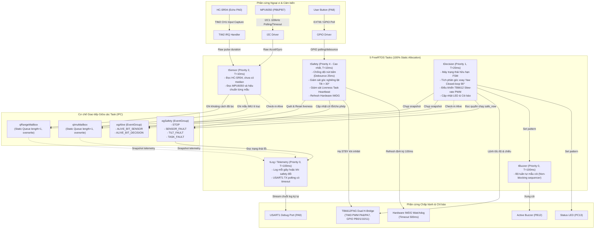
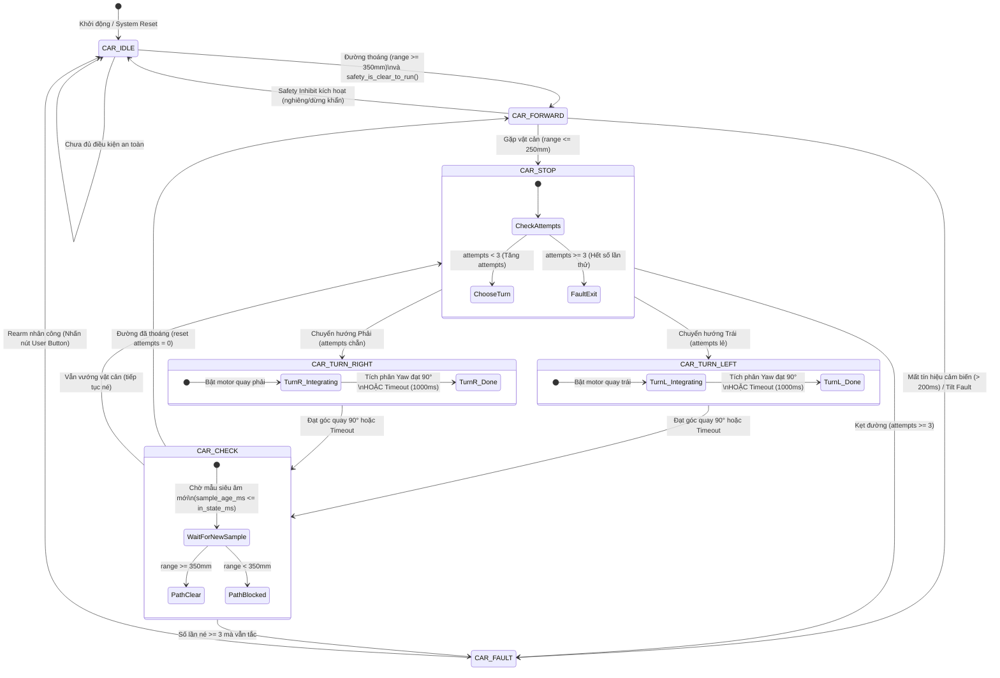

# STM32F103C8T6 Obstacle Avoidance Car

[](https://github.com/NguyenTrongNhan2006/STM32-Obstacle-Avoidance-Car/actions/workflows/ci.yml)
[-blue.svg)](https://www.st.com/en/microcontrollers-microprocessors/stm32f103c8.html)
[-brightgreen.svg)](https://www.freertos.org/)
[-orange.svg)]()
[](LICENSE)

Firmware thử nghiệm xe tránh vật cản trên **STM32F103C8T6 (ARM Cortex-M3 @ 72 MHz)**, do Nhân và Hưng phát triển trong ba tháng. Code và kiểm thử trên máy đã có; phần cứng, thời gian dừng và độ chính xác góc quay vẫn cần đo trên xe.

Xem [trạng thái hiện tại và việc tiếp theo](About/CURRENT_STATUS.md) trước khi đấu nối hoặc nạp firmware.

Toàn bộ hệ thống được xây dựng trên nền tảng **FreeRTOS v11 với 100% cấp phát tĩnh (Static Memory Allocation - 0 byte heap)**, kiến trúc điều khiển kín (**Closed-loop Control**) tích hợp cảm biến góc nghiêng/quán tính 6 trục **IMU MPU6050** qua I2C1 và cảm biến siêu âm **HC-SR04** qua **Timer Input Capture** chính xác mức microsecond.

---

## 1. Tổng quan Kiến trúc Hệ thống

Hệ thống phân tầng **MCAL $\to$ Devices $\to$ App $\to$ Core**; các ngưỡng và mức an toàn dưới đây vẫn là giả định cần kiểm chứng trên phần cứng:
- **Cơ chế cấp phát bộ nhớ tất định (Deterministic Allocation)**: Loại bỏ hoàn toàn heap (`pvPortMalloc`, `malloc`, `free`), loại trừ 100% nguy cơ phân mảnh bộ nhớ (Memory Fragmentation) và rò rỉ bộ nhớ (Memory Leak).
- **Đường điều khiển không chờ hàng trăm mili giây**: Task dùng `xTaskDelayUntil()`. I2C và UART hiện vẫn polling có timeout; xung trigger 10 µs và phục hồi I2C có vòng chờ ngắn. `tSafety` có ưu tiên cao hơn các task này.
- **Không dùng newlib formatted I/O**: Tuyệt đối không dùng `printf`, `sprintf` để tránh phình Flash và nghẽn CPU. Sử dụng bộ định dạng số nguyên siêu nhẹ tùy biến trên USART1.
- **Cơ chế khôi phục I2C Bus Hardware Recovery**: Tự động giải phóng bus SDA bị treo bằng chuỗi xung 9 clock + STOP condition trước khi khởi tạo ngoại vi.
- **Khởi động mềm động cơ**: TIM3 giới hạn mức tăng duty theo cấu hình; tác động lên dòng motor, sụt nguồn và độ bám bánh cần đo thực tế.
- **Giám sát an toàn đa tầng (Multi-layer Safety Monitor)**: Tích hợp bảo vệ góc nghiêng quá ngưỡng (Tilt Fault > 30°), kiểm soát khoảng cách an toàn, kiểm tra tính tươi của dữ liệu cảm biến (Sensor Staleness < 200 ms) và Hardware Watchdog (IWDG) giám sát sống còn (Liveness Heartbeat) của các RTOS Tasks.

---

## 2. Kiến trúc Đa luồng FreeRTOS (Concurrency & Data Flow)

Hệ thống phân chia 5 Task độc lập với mức ưu tiên phân cấp rõ ràng theo chuẩn thời gian thực (**Rate-Monotonic / Deadline-Monotonic Scheduling**). Dữ liệu được trao đổi an toàn qua cơ chế sao chép Mailbox (`qRangeMailbox`, `qImuMailbox`) và đồng bộ hóa qua `EventGroup` (`egSafety`, `egAlive`).



---

## 3. Máy Trạng thái Hữu hạn (Finite State Machine - FSM)

Máy trạng thái điều khiển trung tâm (`obstacle_avoidance`) xử lý logic né tránh vật cản thông minh. Khi phát hiện vật cản ($d \le 250\text{ mm}$), xe chuyển sang trạng thái dừng ngắn, xoay góc kín $90^\circ$ nhờ tích phân con quay hồi chuyển Gyro Z, sau đó đo kiểm tra lại môi trường phía trước trước khi tiếp tục hành trình.



### Chi tiết Thuật toán Quay góc kín (Closed-loop Yaw Turn)
1. **Lọc Dải chết (Deadband Filter)**: Với độ nhạy $131\text{ LSB}/(^\circ/\text{s})$ ở thang đo $\pm 250^\circ/\text{s}$, nếu $|\text{gyro\_raw}[2]| < 100\text{ LSB}$ ($\approx 0.76^\circ/\text{s}$), tốc độ góc được gán về 0 nhằm triệt tiêu hoàn toàn hiện tượng trôi góc (**Drift Accumulation**).
2. **Tích phân Số nguyên (Fixed-point Integration)**:
   $$\Delta \text{yaw}_{\text{mdeg}} = \frac{\frac{\text{raw\_z} \times 1000}{131} \times \Delta t_{\text{ms}}}{1000}$$
   Xe tích lũy góc $\text{integrated\_yaw\_mdeg}$ và tự động dừng quay ngay khi đạt ngưỡng $90,000\text{ mdeg}$ ($90^\circ$).
3. **Phòng vệ Kẹt bánh (Slip / Stall Timeout Fallback)**: Nếu bánh xe trượt hoặc kẹt cơ cấu khiến con quay không đạt đủ $90^\circ$, bộ định thời an toàn `T_TURN_TIMEOUT_MS = 1000 ms` sẽ tự động kích hoạt kết thúc chu kỳ quay để chuyển sang pha kiểm tra, chống cháy động cơ.

---

## 4. Sơ đồ Chân Phần cứng (Hardware Pinout)

> [!CAUTION]
> **CẢNH BÁO PHẦN CỨNG TỐI QUAN TRỌNG (5V TOLERANCE WARNING)**:
> Chân **`PA0` (TIM2_CH1)** trên vi điều khiển STM32F103 là chân Analog đa chức năng (`ADC12_IN0`), **KHÔNG CHỊU ĐƯỢC ĐIỆN ÁP 5V (NOT 5V-TOLERANT)**! 
> Tín hiệu chân **Echo** của cảm biến **HC-SR04** xuất ra mức logic **5V**. Bắt buộc phải sử dụng **mạch cầu phân áp (Voltage Divider)** để hạ áp từ 5V xuống 3.3V (ví dụ: $R_1 = 1\,\text{k}\Omega$ nối tiếp từ Echo, $R_2 = 2\,\text{k}\Omega$ nối xuống GND, chân PA0 nối tại điểm giữa; hoặc cặp $2.2\,\text{k}\Omega / 3.3\,\text{k}\Omega$). Việc nối thẳng chân Echo 5V vào PA0 sẽ phá hủy vĩnh viễn GPIO của vi điều khiển!

> [!WARNING]
> **Trở kéo ngoài bắt buộc (External Pull-up / Pull-down)**:
> - **Chân `PB5` (STBY của TB6612)**: Bắt buộc gắn trở kéo xuống (Pull-down) $10\,\text{k}\Omega$ xuống GND. Giúp bảo đảm cầu H luôn ở trạng thái trở kháng cao (Hi-Z, tắt động cơ) khi MCU đang reset hoặc chưa khởi tạo GPIO.
> - **Chân `PB6` (SCL) và `PB7` (SDA)**: Bắt buộc gắn trở kéo lên (Pull-up) $4.7\,\text{k}\Omega$ lên 3.3V cho đường bus I2C1 để đảm bảo sườn lên xung đồng hồ đạt chuẩn 100 kHz.

| Chân MCU | Chức năng Cấu hình | Ngoại vi Kết nối | Chế độ / Chi tiết Kỹ thuật |
| :--- | :--- | :--- | :--- |
| **`PA0`** | `TIM2_CH1` (Input Capture) | **HC-SR04 Echo** | **Qua cầu phân áp 5V $\to$ 3.3V (Bắt buộc!)**, đo độ rộng xung phản xạ |
| **`PA1`** | `GPIO_Output_PP` | **HC-SR04 Trig** | Phát xung kích độ rộng tối thiểu 10 $\mu$s |
| **`PA6`** | `TIM3_CH1` (Alternate Function PWM) | **TB6612 PWMA** | Điều khiển tốc độ bánh Trái (PWM 20 kHz, dải 0–100%) |
| **`PA7`** | `TIM3_CH2` (Alternate Function PWM) | **TB6612 PWMB** | Điều khiển tốc độ bánh Phải (PWM 20 kHz, dải 0–100%) |
| **`PB0`** | `GPIO_Output_PP` | **TB6612 AIN1** | Điều khiển chiều quay động cơ Trái |
| **`PB1`** | `GPIO_Output_PP` | **TB6612 AIN2** | Điều khiển chiều quay động cơ Trái |
| **`PB10`** | `GPIO_Output_PP` | **TB6612 BIN1** | Điều khiển chiều quay động cơ Phải |
| **`PB11`** | `GPIO_Output_PP` | **TB6612 BIN2** | Điều khiển chiều quay động cơ Phải |
| **`PB5`** | `GPIO_Output_PP` | **TB6612 STBY** | Kích hoạt mạch cầu H (Active High, kèm trở kéo xuống $10\,\text{k}\Omega$) |
| **`PB6`** | `I2C1_SCL` (Alternate Function OD) | **MPU6050 SCL** | Đồng hồ I2C 100 kHz (kèm trở kéo lên $4.7\,\text{k}\Omega$ lên 3.3V) |
| **`PB7`** | `I2C1_SDA` (Alternate Function OD) | **MPU6050 SDA** | Đường dữ liệu I2C (kèm trở kéo lên $4.7\,\text{k}\Omega$ lên 3.3V) |
| **`PA8`** | `GPIO_Input_PullUp` (EXTI8) | **User Button** | Nút bấm chuyển chế độ / Rearm hệ thống sau lỗi (Active Low) |
| **`PC13`** | `GPIO_Output_OD` | **Status LED** | LED báo trạng thái onboard trên Blue Pill (Active Low) |
| **`PB12`** | `GPIO_Output_PP` | **Active Buzzer** | Còi báo động qua tầng đệm transistor NPN |
| **`PA9`** | `USART1_TX` (Alternate Function PP) | **Telemetry / Serial** | Polling có timeout @ 115200 bps, 8N1 |
| **`PA10`** | `USART1_RX` (Input Floating) | **Telemetry / Serial** | Dự phòng nhận lệnh cấu hình |
| **`PA13`** | `SYS_JTMS-SWDIO` | **ST-Link v2** | Giao tiếp nạp chương trình và Debug SWD |
| **`PA14`** | `SYS_JTCK-SWCLK` | **ST-Link v2** | Xung nhịp Debug SWD |

---

## 5. Báo cáo Phân bổ Bộ nhớ (Memory Footprint)

Chạy `cmake --build --preset release` rồi `arm-none-eabi-size -B build/release/obstacle_car.elf` trong `Firmware/` để lấy số hiện tại. CI cũng in footprint sau mỗi build. Số RAM của linker **không** thay thế phép đo stack còn lại khi chạy trên board. FreeRTOS dùng cấp phát tĩnh; đây không phải chứng nhận tuân thủ MISRA.

### Chi tiết Phân bổ Ngân sách RAM Tĩnh:
- **Application Task Stacks (5 tasks)**: $5 \times 256 \times 4\text{ bytes} = 5,120\text{ bytes}$.
- **Kernel Idle + Timer Stacks**: $2 \times 128 \times 4\text{ bytes} = 1,024\text{ bytes}$.
- **Task Control Blocks (TCB - 7 tasks)**: $\approx 7 \times 84\text{ bytes} \approx 588\text{ bytes}$.
- **IPC Objects (Mailboxes + EventGroups)**: $\approx 250\text{ bytes}$.
- **Buffers, HAL State & MSP Interrupt Stack**: $2,000\text{ bytes}$.

---

## 6. Cơ chế An toàn & Độ tin cậy (Safety & Fault Tolerance)

Các lớp bảo vệ đã có trong code, cần đo thời gian phản ứng trên board:
1. **Bảo vệ Lật xe (Tilt Fault Protection)**:
   Góc nghiêng được đo liên tục từ gia tốc kế MPU6050. Thay vì tính hàm lượng giác tốn kém `acos/asin`, hệ thống sử dụng so sánh bình phương vô hướng:
   $$\cos^2(\theta) = \frac{a_z^2}{a_x^2 + a_y^2 + a_z^2} < \cos^2(30^\circ) = \frac{3}{4}$$
   Nếu xe bị nghiêng hoặc lật quá $30^\circ$, động cơ lập tức bị ngắt cưỡng bức và FSM chuyển sang trạng thái an toàn.
2. **Khởi động Mềm (Slew-Rate Ramp Limiter)**:
   Mức tăng Duty Cycle của PWM được giới hạn ở `3‰ / ms` (0,3%/ms). Khi đảo chiều, driver chèn khoảng phanh `MOTOR_DIRECTION_BRAKE_MS = 60 ms`; cả hai con số cần kiểm tra với motor và cầu H thật.
3. **Phòng vệ Kẹt Bus I2C (Bus Recovery)**:
   Nếu bus I2C bị kẹt SDA LOW, `i2c.c` thử phát tối đa 9 xung SCL và STOP trước khi khởi tạo lại ngoại vi.
4. **Hardware Watchdog Đa Luồng (Task Heartbeat IWDG)**:
   IWDG có timeout danh nghĩa 500 ms, biến thiên theo LSI. `tSafety` kiểm tra heartbeat của `tSensor` và `tDecision` mỗi 100 ms; nếu thiếu task, hạ STBY ngay, chốt `TASK_FAULT` và ngừng refresh watchdog. Chỉ nút rearm khi heartbeat và cảm biến tốt mới xoá lỗi. Chưa có số đo thời gian cắt thực trên board.

---

## 7. Hướng dẫn Biên dịch & Nạp Firmware (Build & Flash Guide)

### Yêu cầu Công cụ:
- **ARM GNU Toolchain**: `arm-none-eabi-gcc` $\ge 10.3$
- **Hệ thống Build**: `CMake` $\ge 3.22$ và `Ninja` (hoặc `Make`)
- **Phần mềm Nạp**: `STM32CubeProgrammer CLI` hoặc `OpenOCD`
- **Phần cứng**: Mạch nạp `ST-Link v2` (kết nối SWDIO, SWCLK, GND, 3.3V)

### 1. Kiểm tra Ràng buộc Kỹ thuật Tĩnh (Constraint Verification)
Chạy script kiểm tra để đảm bảo 100% không vi phạm quy tắc cấm `HAL_Delay`, `printf` và cấp phát động:
```bash
# Chạy từ thư mục gốc của repository
bash tools/check_constraints.sh
```

### Kiểm thử hành vi trên máy

```bash
bash Firmware/tools/test_host.sh
```

Script dùng C compiler của máy để chạy kiểm thử safety, hiệu chuẩn IMU, buzzer và log số âm; không thay thế kiểm thử trên STM32.

### 2. Biên dịch Firmware bằng CMake Presets

#### Bản Debug (Hỗ trợ Gỡ lỗi tối ưu, cờ `-Og -g3`):
```bash
cd Firmware
cmake --preset debug
cmake --build --preset debug
```

#### Bản Release (Tối ưu kích thước mã nguồn, cờ `-Os -g`):
```bash
cd Firmware
cmake --preset release
cmake --build --preset release
```
*Tệp nhị phân đầu ra sẽ nằm tại:* `Firmware/build/release/obstacle_car.elf`, `.hex`, `.bin`.

### 3. Kiểm tra Tính toàn vẹn File ELF
```bash
# Kiểm tra file ELF vừa build xong
bash tools/check_constraints.sh build/release/obstacle_car.elf
```

### 4. Nạp Firmware vào STM32F103C8T6

#### Sử dụng STM32CubeProgrammer CLI:
```bash
STM32_Programmer_CLI -c port=SWD mode=UR -w Firmware/build/release/obstacle_car.bin 0x08000000 -v -rst
```

#### Sử dụng OpenOCD:
```bash
openocd -f interface/stlink.cfg -f target/stm32f1x.cfg \
        -c "program Firmware/build/release/obstacle_car.elf verify reset exit"
```

---

## 8. Cấu trúc Thư mục Repository

```text
STM32-Obstacle-Avoidance-Car/
├── .github/
│   └── workflows/
│       └── ci.yml               # CI Pipeline kiểm tra ràng buộc & build tự động
├── tools/
│   └── check_constraints.sh     # Script kiểm tra 0 printf, 0 heap, 0 HAL_Delay
├── docs/                        # Tài liệu đặc tả và các sơ đồ kỹ thuật
├── About/                       # Báo cáo kỹ thuật, timeline và phân tích thiết kế
└── Firmware/
    ├── CMakeLists.txt           # Build script chuẩn hóa với các cờ cảnh báo nghiêm ngặt
    ├── CMakePresets.json        # Định nghĩa cấu hình Debug và Release presets
    ├── Config/                  # Cấu hình chân phần cứng và tham số toàn hệ thống
    │   ├── app_config.h         # Ngân sách RAM, chu kỳ task, tham số FSM
    │   ├── board_config.h       # Ánh xạ GPIO, Timer, I2C, UART
    │   └── project_types.h      # Kiểu status/mẫu cảm biến
    ├── Core/                    # Điểm khởi tạo hệ thống, clock 72MHz, RTOS scheduler
    │   ├── Src/main.c           # Khởi tạo 5 Task tĩnh và điều phối hệ thống
    │   └── Inc/FreeRTOSConfig.h # Cấu hình FreeRTOS tĩnh
    ├── Drivers/
    │   ├── MCAL/                # Lớp trừu tượng hóa vi điều khiển (GPIO, PWM, I2C, Timebase, UART)
    │   └── Devices/             # Driver thiết bị (TB6612, MPU6050, HC-SR04, Buzzer, Button, LED)
    ├── App/                     # Lớp logic nghiệp vụ ứng dụng
    │   ├── Src/robot_car.c      # Bộ điều phối trung tâm App
    │   ├── Src/obstacle_avoidance.c # Máy trạng thái FSM né vật cản & tích phân góc kín
    │   ├── Src/safety_monitor.c # Giám sát an toàn lật xe & liveness watchdog
    │   └── Src/sensor_manager.c # Lấy mẫu siêu âm và IMU qua mailbox
    ├── Tests/Host/             # Kiểm thử hành vi với mock trên máy
    └── ThirdParty/              # Thư viện CMSIS, STM32F1xx HAL, FreeRTOS-Kernel v11
```

---

## 9. Bản quyền (License)

Dự án được phát hành theo giấy phép [MIT License](LICENSE).  
Copyright (c) 2026 Nguyễn Trọng Nhân. All rights reserved.  
*Các thư viện bên thứ ba (ARM CMSIS, ST HAL, FreeRTOS-Kernel) tuân theo giấy phép gốc tương ứng.*
