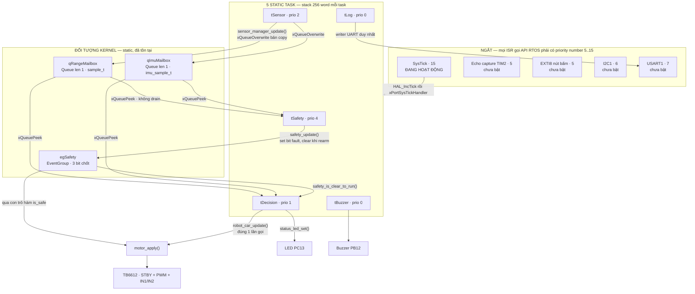
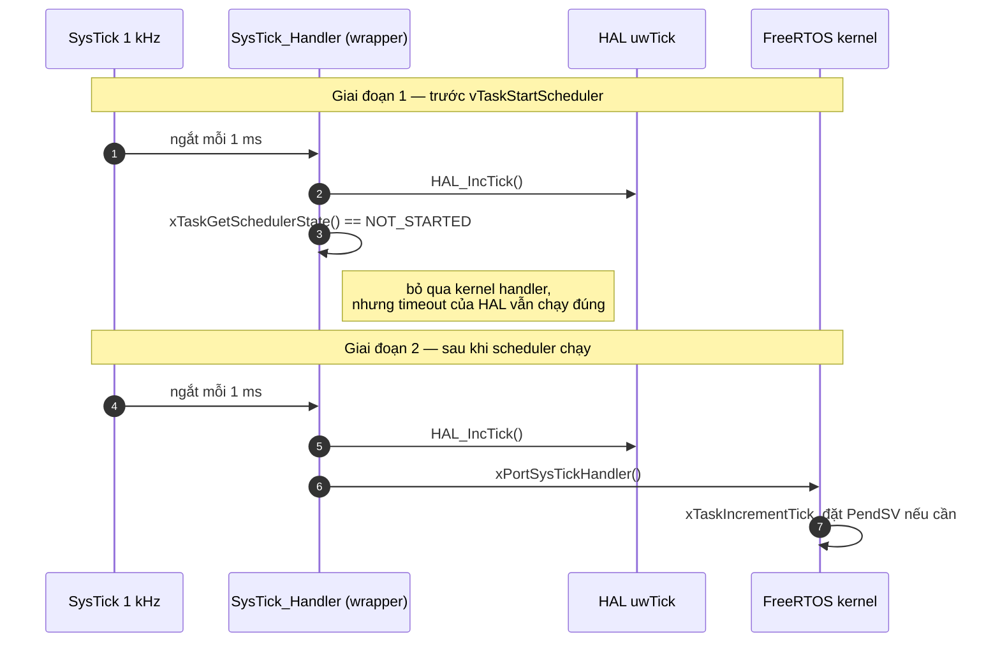
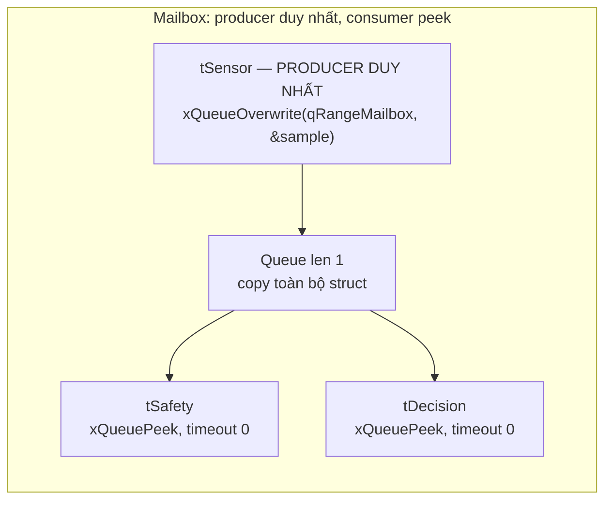
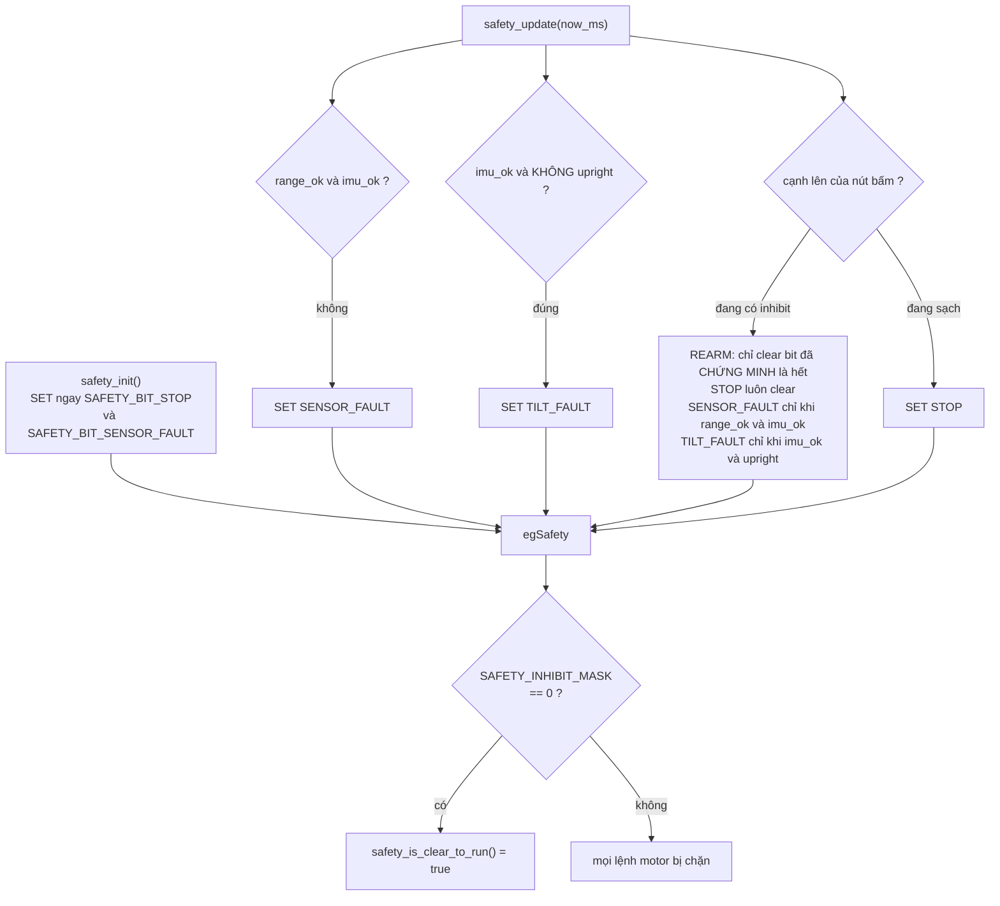
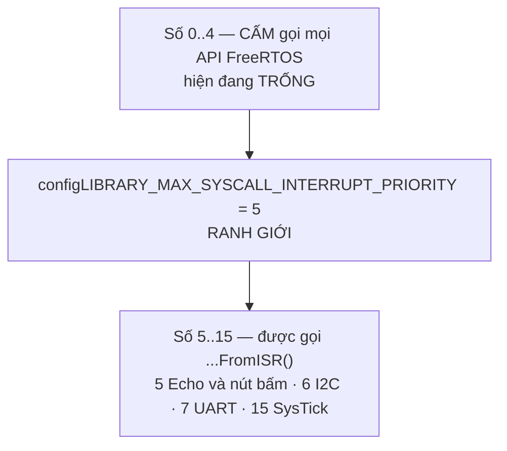

# FreeRTOS — task, ngắt và cơ chế đồng bộ

[◀ Về README chính](../../README.md) · [Sơ đồ phần cứng](hardware_block_diagram.md) · [Kiến trúc phần mềm](software_architecture.md) · [FSM điều khiển](fsm_control_flow.md)

Cấu hình kernel ở [`Firmware/Core/Inc/FreeRTOSConfig.h`](../../Firmware/Core/Inc/FreeRTOSConfig.h),
task layout ở [`Firmware/Config/app_config.h`](../../Firmware/Config/app_config.h).

> **Trạng thái:** 5 task đã được tạo và scheduler chạy, nhưng thân cả 5 task mới
> chỉ là `vTaskDelay()`. Đối tượng kernel (2 mailbox + 1 event group) đã tồn tại
> thật và các hàm App thao tác lên chúng đã viết xong.

---

## 1. Toàn cảnh luồng dữ liệu



## 2. Bảng task

`configMAX_PRIORITIES = 5` → priority hợp lệ là **0..4**, số **lớn hơn = ưu tiên cao hơn**
(ngược với đánh số NVIC).

| Task | Prio | Chu kỳ skeleton | Chu kỳ đích | Stack | Chủ sở hữu | Nhiệm vụ |
| --- | --- | --- | --- | --- | --- | --- |
| `tSafety` | **4** | 100 ms | **10 ms** `[DO]` | 256 w / 1024 B | Nhân | Chốt STOP/fault, kiểm tra freshness và tilt |
| *(kernel)* `Tmr Svc` | 3 | sự kiện | — | 128 w / 512 B | — | Software timer |
| `tSensor` | 2 | 100 ms | range 60 ms, IMU 10 ms `[DO]` | 256 w / 1024 B | Hưng | Lấy mẫu, ghi 2 mailbox bản copy |
| `tDecision` | 1 | 100 ms | **20 ms** `[DO]` | 256 w / 1024 B | Nhân | FSM + `robot_car_update()` |
| `tLog` | 0 | 100 ms | — | 256 w / 1024 B | Hưng | Telemetry có giới hạn, **writer UART duy nhất** |
| `tBuzzer` | 0 | 100 ms | — | 256 w / 1024 B | Hưng | Mẫu còi theo deadline, phải block/yield ở prio 0 |
| *(kernel)* `IDLE` | 0 | — | — | 128 w / 512 B | — | — |

> Chu kỳ 100 ms hiện tại **chỉ là sleep của skeleton**, không phải deadline an toàn
> hay điều khiển. `tSafety` và `tDecision` phải xuống 10 ms / 20 ms trước khi có motor thật.
>
> `tLog` và `tBuzzer` cùng priority 0 với Idle task nên phụ thuộc
> `configUSE_TIME_SLICING = 1`; cả hai **bắt buộc** block hoặc yield, không được spin.

## 3. SysTick wrapper — HAL và kernel dùng chung một timer

F103C8T6 không còn timer rảnh để làm HAL timebase riêng, nên HAL và FreeRTOS dùng
chung SysTick. Cách nối nằm ở [`stm32f1xx_it.c`](../../Firmware/Core/Src/stm32f1xx_it.c):

```c
void SysTick_Handler(void)
{
    HAL_IncTick();                                          /* luôn chạy */
    if (xTaskGetSchedulerState() != taskSCHEDULER_NOT_STARTED) {
        xPortSysTickHandler();                              /* chỉ sau khi scheduler chạy */
    }
}
```



Ba hệ quả:

- **`configUSE_TICK_HOOK = 0`** — không cần tick hook vì wrapper đã gọi `HAL_IncTick()` trực tiếp.
- **Timeout của HAL hoạt động cả trước lẫn sau scheduler**, nên `HAL_RCC_OscConfig()`
  vẫn hết giờ đúng hạn nếu thạch anh HSE không khởi động.
- **`SVC_Handler` và `PendSV_Handler` alias thẳng vào `port.c`** qua macro trong
  `FreeRTOSConfig.h`, **không** bọc hàm C — chúng là naked handler.
  `stm32f1xx_it.c` vì vậy tuyệt đối không được định nghĩa lại hai tên đó.

## 4. Mailbox bản copy — vì sao không dùng mutex



| Đặc điểm | Vì sao |
| --- | --- |
| **Copy** toàn bộ `sample_t` / `imu_sample_t` | Consumer luôn thấy một mẫu nhất quán: giá trị + đơn vị + timestamp + status cùng một lần chụp |
| **Peek**, không receive | Không drain hàng đợi — nhiều consumer đọc được cùng một mẫu |
| Timeout **0** | `tSafety` (priority cao nhất) **không bao giờ block** → không có priority inversion trên đường an toàn |
| Producer **duy nhất** là `tSensor` | Không có tranh chấp ghi → không cần mutex |
| Khởi tạo bằng `SAMPLE_NOT_READY` | Mailbox rỗng không thể bị hiểu nhầm là "đo được 0 mm" |

`sensor_manager_get_latest()` trả `STATUS_OK` chỉ có nghĩa là **đã lấy được bản
copy**, không có nghĩa dữ liệu hợp lệ. Hai mẫu cũng **không** phải một lần chụp
đồng thời — caller bắt buộc tự kiểm tra `status` và tuổi của **từng** mẫu.

## 5. `egSafety` — fault chốt, rearm phải có chủ đích



| Bit | Đặt khi nào | Xoá khi nào |
| --- | --- | --- |
| `SAFETY_BIT_STOP` | Lúc boot; mỗi lần nhấn nút khi hệ thống đang sạch | Khi nhấn nút lúc đang có inhibit |
| `SAFETY_BIT_SENSOR_FAULT` | Lúc boot; khi range hoặc IMU thiếu/quá hạn/lỗi | Chỉ khi rearm **và** cả hai mẫu đang hợp lệ |
| `SAFETY_BIT_TILT_FAULT` | Khi IMU hợp lệ nhưng xe không thẳng đứng | Chỉ khi rearm **và** IMU hợp lệ và đang thẳng đứng |

Bốn nguyên tắc:

1. **Chốt lúc boot.** Xe không thể chạy chỉ vì vừa cấp nguồn xong.
2. **Fault chốt lại (latch).** Không dòng nào tự xoá bit; dữ liệu vắng mặt hoặc
   quá hạn là **bằng chứng của lỗi**, không bao giờ là bằng chứng của sức khoẻ.
3. **Rearm chỉ xoá bit đã chứng minh là hết.** Nhấn nút không bao giờ xoá một
   fault chưa được chứng minh là đã biến mất.
4. **Một nút, hai vai trò, theo cạnh.** Đang sạch mà nhấn → STOP; đang bị chặn mà
   nhấn → rearm. `button_was_pressed` khởi tạo `true` để trạng thái nút chưa biết
   không bị hiểu nhầm thành một lần nhả đang chờ nhấn.

## 6. Kiểm tra tilt không cần quy đổi độ

Full-scale range của accelerometer **chưa xác nhận**, nên không thể quy raw sang
độ. `imu_upright()` so sánh bình phương để thang đo tự triệt tiêu:

```
cos²(tilt) = az² / (ax² + ay² + az²)      →      az² × TILT_COS2_DEN >= tổng × TILT_COS2_NUM
```

| Hằng số | Giá trị | Ghi chú |
| --- | --- | --- |
| `TILT_LIMIT_DEG` | 30 | `[DO]` |
| `TILT_COS2_NUM` / `TILT_COS2_DEN` | 3 / 4 | `cos²(30°) = 3/4`. **Không** dẫn xuất tự động từ `TILT_LIMIT_DEG` lúc biên dịch — đổi thì phải đổi cả hai |

`az <= 0` (xe lật ngửa) và `total == 0` (dữ liệu vô nghĩa) đều trả `false`.
`[DO]` — giả định `accel_raw[2]` là trục thẳng đứng và đọc dương khi xe nằm phẳng;
phải xác nhận hướng lắp trước khi tin vào phép kiểm tra này.

## 7. Ranh giới NVIC priority



- CMSIS nhận **số chưa dịch bit**; FreeRTOS dịch lên 4 bit cao qua
  `configMAX_SYSCALL_INTERRUPT_PRIORITY`.
- `main()` gọi `HAL_NVIC_SetPriorityGrouping(NVIC_PRIORITYGROUP_4)` — toàn bộ 4 bit
  là preempt priority, **không có subpriority**.
- `_Static_assert(configPRIO_BITS == __NVIC_PRIO_BITS, ...)` bắt lỗi lệch ngay lúc biên dịch.
- Vi phạm ranh giới **không crash ngay** — nó làm hỏng kernel list ngẫu nhiên.
  `configASSERT` phải luôn bật vì chính nó kích hoạt `vPortValidateInterruptPriority()`.

## 8. Ngân sách RAM — kiểm tra ngay lúc biên dịch

`main.c` không chỉ ghi ngân sách vào comment mà **ép linker/compiler kiểm tra**:

```c
_Static_assert(
    sizeof(task_stacks) + sizeof(idle_stack) + sizeof(timer_stack) +
    sizeof(task_controls) + sizeof(idle_control) + sizeof(timer_control) +
    2U * sizeof(StaticQueue_t) + sizeof(sample_t) + sizeof(imu_sample_t) +
    sizeof(StaticEventGroup_t) + APP_KERNEL_DATA_RESERVE_BYTES + APP_MSP_RESERVE_BYTES
    < APP_SRAM_BYTES, "Static RAM planning budget exceeded");
```

| Hạng mục | Kích thước |
| --- | --- |
| 5 task stack × 256 word | 5 120 B |
| Idle + Timer stack, 2 × 128 word | 1 024 B |
| 7 × `StaticTask_t` | — `sizeof` kiểm tra trong `main.c` |
| 2 mailbox + `sample_t` + `imu_sample_t` | — |
| `StaticEventGroup_t` | — |
| Dự phòng kernel/HAL/data/alignment | 4 096 B |
| Dự phòng MSP (ISR stack) | 1 024 B |
| **Trần** | **20 480 B** |

Dự phòng là **khoản trù tính, không thay thế việc đo**. `CMakeLists.txt` bật
`-fstack-usage` để sinh file `.su` đối chiếu, và `-Wl,--print-memory-usage` in
%FLASH/%RAM sau mỗi lần link. Đo stack thật bằng `uxTaskGetStackHighWaterMark()`.

## 9. Quy tắc viết ISR

| Phải | Không được |
| --- | --- |
| Capture event / chụp timestamp / set bit, rồi `portYIELD_FROM_ISR()` | Chạy thuật toán né vật cản |
| Priority number 5..15 nếu có gọi API kernel | Gọi API kernel bản **không** `FromISR` |
| Giữ thời gian chạy ở mức µs | Chờ I2C, chờ UART, in log |

Skeleton hiện dùng macro `UNIMPLEMENTED_IRQ(name)` để mọi IRQ chưa có chủ sở hữu
rơi vào `configASSERT(0)`. Đây là **bẫy chẩn đoán lúc bring-up**, không phải cách
xử lý fault cuối cùng — phải thay bằng handler thật trước khi bật ngoại vi tương ứng.
