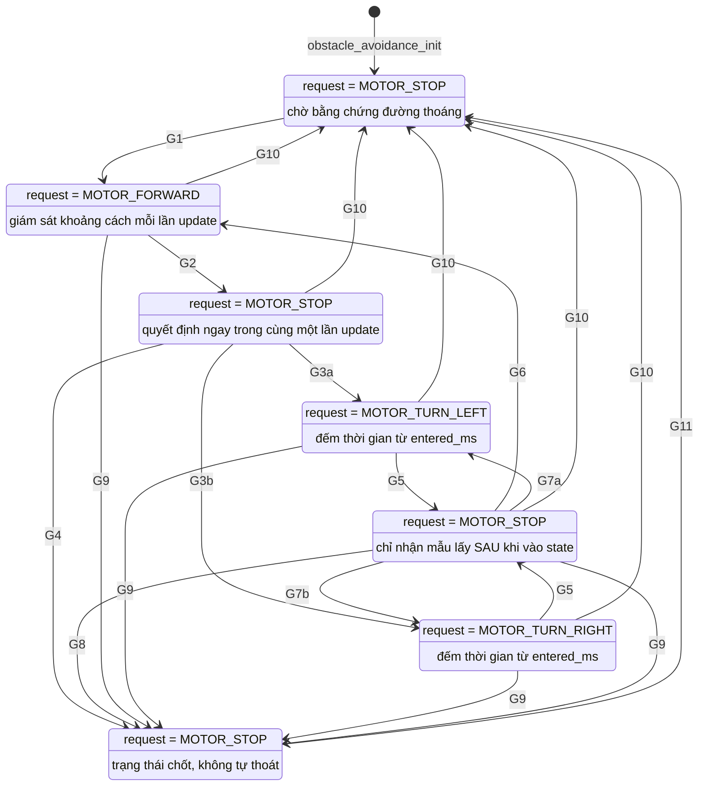
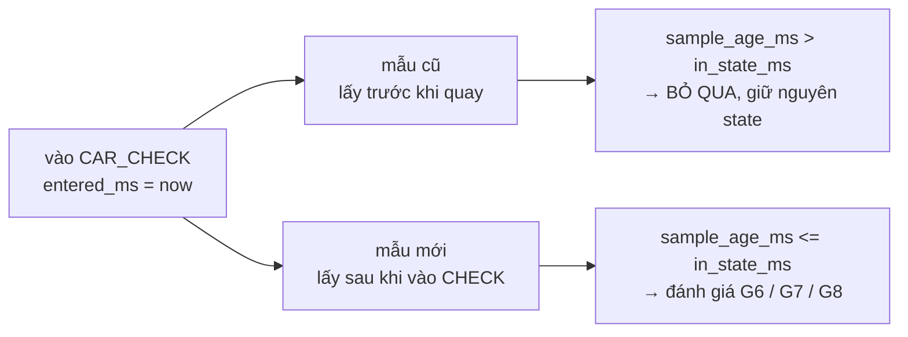
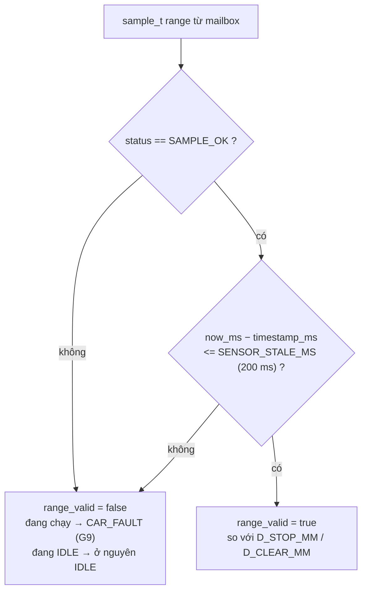

# FSM điều khiển — `obstacle_avoidance`

[◀ Về README chính](../../README.md) · [Sơ đồ phần cứng](hardware_block_diagram.md) · [Kiến trúc phần mềm](software_architecture.md) · [Concurrency](freertos_concurrency.md)

FSM nằm trong [`Firmware/App/Src/obstacle_avoidance.c`](../../Firmware/App/Src/obstacle_avoidance.c),
được `robot_car_update()` gọi từ `tDecision`. Enum `car_state_t` khai báo trong
[`obstacle_avoidance.h`](../../Firmware/App/Inc/obstacle_avoidance.h).

> **Trạng thái:** logic FSM đã viết xong và chạy được, nhưng
> `sensor_manager_update()` còn trả `NOT_READY` nên mailbox chưa có mẫu thật, và
> `motor_apply()` luôn tắt bridge. FSM vì vậy **chưa điều khiển xe**.

---

## 1. Máy trạng thái 7 state



## 2. Bảng chú giải điều kiện chuyển trạng thái

Ba guard **G9, G10, G11 được đánh giá trước** phần `switch`, nên chúng thắng mọi
guard còn lại.

| ID | Từ → Đến | Điều kiện | Hành động |
| --- | --- | --- | --- |
| **G9** | mọi state trừ `IDLE`/`FAULT` → `FAULT` | `!range_valid` — tức `range->status != SAMPLE_OK` **hoặc** `now_ms − range->timestamp_ms > SENSOR_STALE_MS` | `enter_state(FAULT)`. Ở `IDLE` thì **không** thành fault: đứng yên mà thiếu dữ liệu chỉ nghĩa là chưa có bằng chứng để khởi hành |
| **G10** | mọi state trừ `IDLE` → `IDLE` | `!safety_is_clear_to_run()` — có bit trong `SAFETY_INHIBIT_MASK` | `enter_state(IDLE)` |
| **G11** | `FAULT` → `IDLE` | Chỉ qua **rearm có chủ đích**: `robot_car_update()` phát hiện cạnh lên của `safety_is_clear_to_run()` rồi gọi lại `obstacle_avoidance_init()` | reset toàn bộ context |
| **G1** | `IDLE` → `FORWARD` | `clear_ahead` (`range->value >= D_CLEAR_MM`, 350 mm) | `attempts = 0`; `request = MOTOR_FORWARD` |
| **G2** | `FORWARD` → `STOP` | `blocked` (`range->value <= D_STOP_MM`, 250 mm) | `enter_state(STOP)`; `request` giữ `MOTOR_STOP` |
| **G3a** | `STOP` → `TURN_LEFT` | `attempts < MAX_AVOIDANCE_ATTEMPTS` **và** `attempts` sau khi tăng là **lẻ** | `attempts++`; `entered_ms = now_ms` |
| **G3b** | `STOP` → `TURN_RIGHT` | Như G3a nhưng `attempts` sau khi tăng là **chẵn** | như trên |
| **G4** | `STOP` → `FAULT` | `attempts >= MAX_AVOIDANCE_ATTEMPTS` (3) | `enter_state(FAULT)` |
| **G5** | `TURN_*` → `CHECK` | `now_ms − entered_ms >= T_TURN_MS` (400 ms) | `enter_state(CHECK)` |
| **G6** | `CHECK` → `FORWARD` | Mẫu **mới** (xem §4) **và** `clear_ahead` | `attempts = 0`; `request = MOTOR_FORWARD` |
| **G7a/b** | `CHECK` → `TURN_LEFT`/`TURN_RIGHT` | Mẫu mới, **không** `clear_ahead`, còn lượt thử | `attempts++`, hướng theo `next_turn()` |
| **G8** | `CHECK` → `FAULT` | Mẫu mới, không thoáng, `attempts >= MAX_AVOIDANCE_ATTEMPTS` | `enter_state(FAULT)` |

> Trong `CHECK`, nếu **chưa** có mẫu mới thì không guard nào kích hoạt — FSM giữ
> nguyên state và `request` vẫn là `MOTOR_STOP`. Xe đứng yên chờ, không trôi.

## 3. Chọn hướng quay khi không có cảm biến hai bên

Không có IR trái/phải, nên hướng quay là **phương án thử**, không phải hướng đã
đo là an toàn. `next_turn()` **luân phiên** để một bên bị chặn không bị thử lại mãi:

```c
static car_state_t next_turn(uint8_t attempts)
{
    return ((attempts & 1U) != 0U) ? CAR_TURN_LEFT : CAR_TURN_RIGHT;
}
```

| `attempts` sau khi tăng | Hướng thử |
| --- | --- |
| 1 | `CAR_TURN_LEFT` |
| 2 | `CAR_TURN_RIGHT` |
| 3 | `CAR_TURN_LEFT` |
| ≥ 3 ở lần kiểm tra kế tiếp | → `CAR_FAULT` |

> ⚠️ `T_TURN_MS = 400` là `[DO]`. **Không suy ra góc quay từ con số này** — chưa có
> encoder hay phản hồi yaw, nên thời gian quay không tương đương góc.

## 4. Mẫu "mới" trong `CHECK` — và chống tràn tick

Một phép đo lấy **trước** khi quay không nói gì về hướng mới. `CHECK` vì vậy chỉ
chấp nhận mẫu có tuổi nhỏ hơn thời gian đã ở trong state:

```c
const uint32_t sample_age_ms = now_ms - range->timestamp_ms;
if (sample_age_ms <= in_state_ms) { /* mẫu lấy sau khi vào CHECK */ }
```



**Cả hai vế đều là khoảng thời gian đã trôi** (`now_ms − X`), không phải mốc thời
gian tuyệt đối. Phép trừ unsigned nên so sánh vẫn đúng khi bộ đếm ms tràn.
Cùng kỹ thuật đó dùng ở `range_valid` và `sample_fresh()`.

| Biến | Kiểu | Đặt khi nào | Dùng ở guard |
| --- | --- | --- | --- |
| `context->state` | `car_state_t` | mỗi `enter_state()` | tất cả |
| `context->entered_ms` | `uint32_t` (ms) | mỗi `enter_state()` | G5, G6, G7, G8 |
| `context->attempts` | `uint8_t` | G1, G6 (reset về 0) · G3, G7 (tăng) | G3, G4, G7, G8 |

## 5. Guard trên dữ liệu cảm biến

**Thiếu cảm biến không đồng nghĩa đường trống.** Chỉ `SAMPLE_OK` **và** còn hạn
mới được dùng để so ngưỡng.



| `sample_status_t` | Ý nghĩa |
| --- | --- |
| `SAMPLE_OK` | Đo được, dùng để so ngưỡng |
| `SAMPLE_STALE` | Quá hạn |
| `SAMPLE_TIMEOUT` | Hết `ECHO_TIMEOUT_US` (30 ms) không nhận echo |
| `SAMPLE_ERROR` | Lỗi phần cứng / bus |
| `SAMPLE_NOT_READY` | Chưa có mẫu nào — **giá trị khởi tạo của mailbox** |

## 6. Ngưỡng và hằng số

| Hằng số | Giá trị | Trạng thái |
| --- | --- | --- |
| `D_STOP_MM` | 250 mm | `[DO]` |
| `D_CLEAR_MM` | 350 mm | `[DO]` — hysteresis 100 mm; một ngưỡng duy nhất sẽ gây dao động |
| `T_TURN_MS` | 400 ms | `[DO]` |
| `MAX_AVOIDANCE_ATTEMPTS` | 3 | tránh vòng lặp quay vô hạn khi kẹt góc tường |
| `SENSOR_STALE_MS` | 200 ms | `[DO]` |
| `DRIVE_SPEED_PERCENT` | 35 % | `[DO]` |
| `TURN_SPEED_PERCENT` | 30 % | `[DO]` |
| `DECISION_TARGET_PERIOD_MS` | 20 ms | `[DO]` — chu kỳ đích của `tDecision`, skeleton đang chạy 100 ms |

Điều kiện dẫn xuất ghi trong `app_config.h`:

```
d_stop >= v_max × (t_sample + t_scheduling + t_actuation)
          + quãng đường phanh/trôi đo được + margin
```

> Toàn bộ hằng số trên là **đề xuất chưa đo**. Quan hệ với tốc độ là tuyến tính:
> tăng `DRIVE_SPEED_PERCENT` thì `D_STOP_MM` phải tính lại.

## 7. Vì sao không dùng `vTaskDelay()` để đo thời lượng state

`obstacle_avoidance_update()` **không block**: nó nhận `now_ms`, đánh giá guard,
trả về `motor_cmd_t` rồi kết thúc. Thời lượng state đo bằng `entered_ms`.

```c
/* SAI — khóa FSM 400 ms; nút bấm và cảm biến bị bỏ qua suốt khoảng đó */
case CAR_TURN_LEFT:
    *request = MOTOR_TURN_LEFT;
    vTaskDelay(pdMS_TO_TICKS(T_TURN_MS));
    enter_state(context, CAR_CHECK, now_ms);
    break;

/* ĐÚNG — mỗi lần update vẫn đánh giá lại toàn bộ guard */
case CAR_TURN_LEFT:
case CAR_TURN_RIGHT:
    if (in_state_ms >= T_TURN_MS) {
        enter_state(context, CAR_CHECK, now_ms);
    } else {
        *request = (context->state == CAR_TURN_LEFT) ? MOTOR_TURN_LEFT : MOTOR_TURN_RIGHT;
    }
    break;
```

Điểm block duy nhất nằm ở vòng lặp của `tDecision`, không nằm trong FSM.
