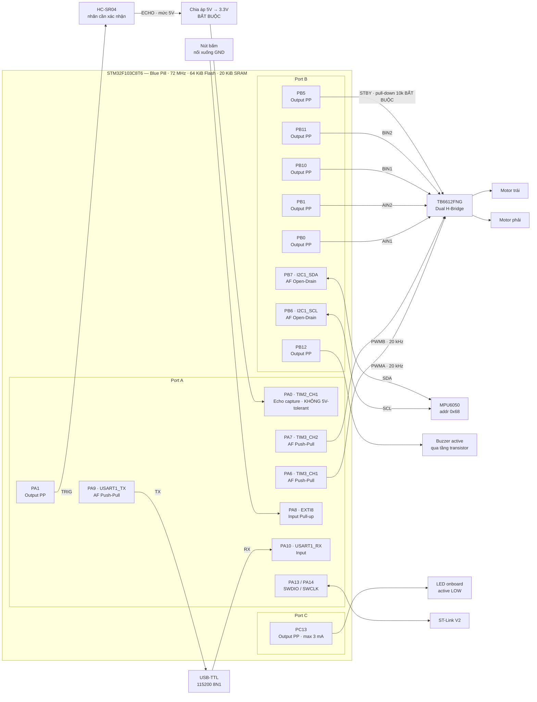
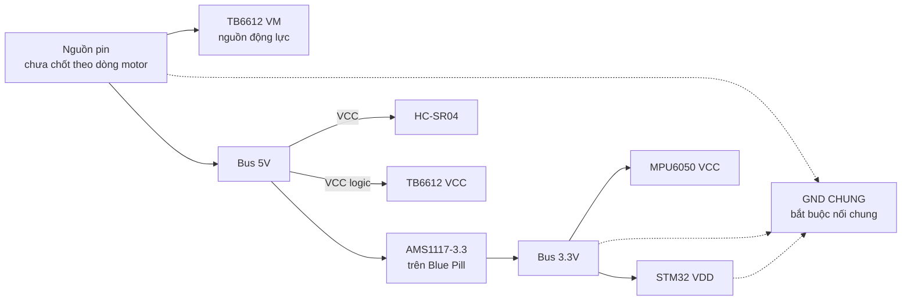

# Sơ đồ khối phần cứng

[◀ Về README chính](../../README.md) · [Kiến trúc phần mềm](software_architecture.md) · [FSM điều khiển](fsm_control_flow.md) · [Concurrency](freertos_concurrency.md)

Sơ đồ này dựng từ [`Firmware/Config/board_config.h`](../../Firmware/Config/board_config.h).
Khi sơ đồ mâu thuẫn với file đó, **file đó thắng**.

> **Trạng thái:** pin map là đề xuất `[DO]`, chưa đối chiếu schematic thật.
> Trong skeleton hiện tại chỉ `gpio_init()` cấu hình chân; PWM, Echo capture và
> I2C vẫn do module chủ sở hữu cấu hình ở mốc C và F.

---

## 1. Sơ đồ kết nối

## 2. Cây nguồn

> ⚠️ Nguồn động lực và nguồn logic phải **chung GND**. Không cấp nguồn motor từ
> chân GPIO hay từ 3.3V của board.

---

## 3. Bảng chân

| Chân | Macro | Chức năng | Chế độ GPIO | Trạng thái |
| --- | --- | --- | --- | --- |
| `PA0` | `RANGE_ECHO_PIN` | HC-SR04 Echo, capture `TIM2_CH1` | Input (chưa cấu hình) | ⚠️ **Không 5V-tolerant** — xem cảnh báo [2] |
| `PA1` | `RANGE_TRIG_PIN` | HC-SR04 Trigger | Output Push-Pull | ✅ `gpio_init()` đã kéo xuống LOW |
| `PA6` | `MOTOR_LEFT_PWM_PIN` | PWM bánh trái, `TIM3_CH1` | AF Push-Pull | mốc C — `pwm` chưa cấu hình |
| `PA7` | `MOTOR_RIGHT_PWM_PIN` | PWM bánh phải, `TIM3_CH2` | AF Push-Pull | mốc C |
| `PA8` | `BUTTON_PIN` | Nút bấm duy nhất, `EXTI8` | Input Pull-up, active LOW | ✅ đã cấu hình; EXTI **chưa bật** |
| `PA9` | `DEBUG_TX_PIN` | `USART1_TX` 115200 | AF Push-Pull | ✅ `uart_debug_init()` |
| `PA10` | `DEBUG_RX_PIN` | `USART1_RX` | Input | ✅ |
| `PA13`/`PA14` | — | SWDIO / SWCLK | AF mặc định | **giữ nguyên**, không cấu hình lại |
| `PB0` | `MOTOR_AIN1_PIN` | Hướng motor trái | Output Push-Pull | ✅ init LOW |
| `PB1` | `MOTOR_AIN2_PIN` | Hướng motor trái | Output Push-Pull | ✅ init LOW |
| `PB5` | `MOTOR_STBY_PIN` | TB6612 STBY | Output Push-Pull | ✅ init LOW — **cần pull-down 10k ngoài** |
| `PB6` | `IMU_SCL_PIN` | `I2C1_SCL` | AF Open-Drain | mốc F — `i2c` chưa cấu hình |
| `PB7` | `IMU_SDA_PIN` | `I2C1_SDA` | AF Open-Drain | mốc F |
| `PB10` | `MOTOR_BIN1_PIN` | Hướng motor phải | Output Push-Pull | ✅ init LOW |
| `PB11` | `MOTOR_BIN2_PIN` | Hướng motor phải | Output Push-Pull | ✅ init LOW |
| `PB12` | `BUZZER_PIN` | Buzzer active | Output Push-Pull | ✅ init LOW |
| `PC13` | `STATUS_LED_PIN` | LED trạng thái, active LOW | Output Push-Pull, Low speed | ✅ init tắt |

**Không có cảm biến IR trái/phải** trong phạm vi ba tháng — xem `CLAUDE.md`.
Hướng quay vì vậy là **phương án thử**, không phải hướng đã đo là an toàn.

**Chế độ Analog:** không dùng chân analog nào; thiết kế hiện tại không có kênh ADC.

## 4. Quyền sở hữu tài nguyên — mỗi timer/bus đúng một chủ

| Tài nguyên | Chủ sở hữu | Dùng làm gì | Trạng thái |
| --- | --- | --- | --- |
| `TIM3` | `pwm` | PWM motor 20 kHz | mốc C |
| `TIM2` | `timebase` | Input capture Echo, 1 MHz tick | mốc D, chưa init |
| `TIM4` | — | **còn trống** | dự phòng |
| `I2C1` | `i2c` | MPU6050 | mốc F |
| `USART1` | `uart_debug` | Log, một writer duy nhất | ✅ hoạt động |
| `EXTI8` | `exti` | Nút bấm PA8 | chưa bật |
| `SysTick` | FreeRTOS kernel + HAL tick wrapper | tick 1 kHz | ✅ |

## 5. Bảng NVIC priority

| IRQ | Macro | Priority |
| --- | --- | --- |
| Echo capture | `IRQ_PRIO_ECHO` | 5 |
| Nút bấm | `IRQ_PRIO_BUTTON` | 5 |
| I2C | `IRQ_PRIO_I2C` | 6 |
| UART | `IRQ_PRIO_UART` | 7 |
| SysTick | `IRQ_PRIO_SYSTICK` | 15 |

- STM32F1 có **4 priority bit**; **số càng nhỏ, ưu tiên càng cao**.
- Mọi ISR gọi API `...FromISR()` phải có số **≥ 5** (`configLIBRARY_MAX_SYSCALL_INTERRUPT_PRIORITY`) và ≤ 15.
- Skeleton hiện **chưa bật ngắt ngoại vi nào**; bảng trên là phân bổ trước.

## 6. Cảnh báo phần cứng

| # | Nội dung | Hậu quả nếu bỏ qua |
| --- | --- | --- |
| 1 | **Pull-down 10k trên STBY của TB6612 (PB5).** `gpio_emergency_stop()` kéo STBY xuống ngay đầu `gpio_init()`, nhưng khoảng từ lúc cấp nguồn tới lúc dòng đó chạy thì chân vẫn floating — chỉ điện trở ngoài mới giữ được. | Motor chạy ngoài ý muốn lúc MCU reset |
| 2 | **PA0 không phải chân 5V-tolerant.** Echo của HC-SR04 xuất 5V nên **bắt buộc** hạ áp ngoài (chia áp 1k/2k hoặc level shifter). | Hỏng chân PA0 |
| 3 | Nhãn cảm biến khoảng cách chưa xác nhận (tạm gọi HC-SR04, cần kiểm tra nhãn "HR-04") | Sai timing trigger/echo |
| 4 | PC13 chỉ chịu ~3 mA — chỉ dùng cho LED onboard | Hỏng chân |
| 5 | PA13/PA14 dành riêng cho SWD | Mất đường debug |
| 6 | Nguồn motor và nguồn logic phải chung GND | Mức logic không xác định |
| 7 | Buzzer ở PB12 cần **tầng transistor**, không kéo trực tiếp từ GPIO | Quá dòng chân |
| 8 | Dòng motor và điện áp pin **chưa chốt** | Chọn sai nguồn/driver |
