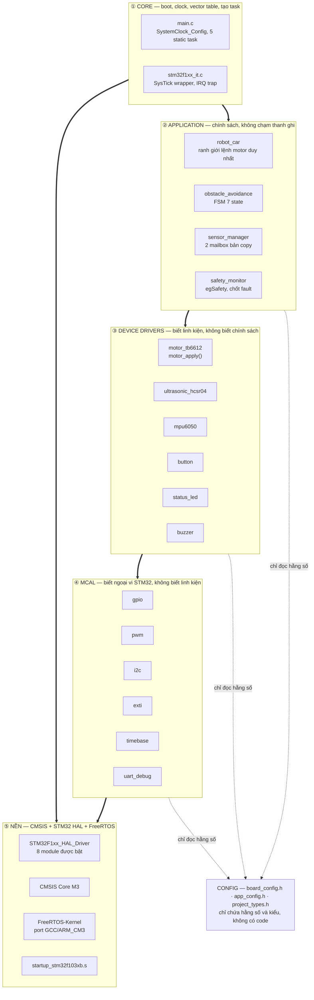
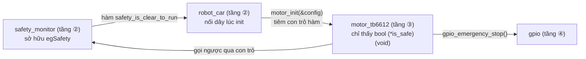
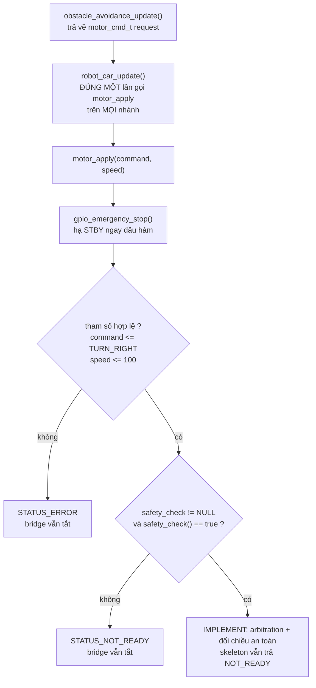

# Kiến trúc phần mềm phân tầng

[◀ Về README chính](../../README.md) · [Sơ đồ phần cứng](hardware_block_diagram.md) · [FSM điều khiển](fsm_control_flow.md) · [Concurrency](freertos_concurrency.md)

Quy tắc phụ thuộc lấy từ `CLAUDE.md`: **Core → App → Devices → MCAL → Config**.

---

## 1. Năm tầng



## 2. Dependency Rule

> **Tầng trên gọi xuống tầng dưới. Tầng dưới KHÔNG BAO GIỜ include ngược lên.**
> Cụ thể trong repo này: **không driver nào được `#include` file của App.**

| Tầng | ĐƯỢC include | **CẤM** include |
| --- | --- | --- |
| ① Core | `*.h` của App, MCAL, Config, FreeRTOS | — |
| ② App | `*.h` của Devices, Config, FreeRTOS | `stm32f1xx_hal_*.h`, thanh ghi trực tiếp |
| ③ Devices | `*.h` của MCAL, Config | **`robot_car.h`, `safety_monitor.h`, `sensor_manager.h`, `obstacle_avoidance.h`** |
| ④ MCAL | `stm32f1xx_hal.h`, `board_config.h` | `*.h` của Devices và App |
| ⑤ Nền | chỉ chính nó | mọi thứ của dự án |

### Cách giải quyết mâu thuẫn: `motor_tb6612` cần biết trạng thái an toàn

`motor_apply()` (tầng ③) phải kiểm tra `egSafety` — nhưng `egSafety` thuộc
`safety_monitor` ở tầng ②. Include ngược lên là vi phạm. Giải pháp là **tiêm
con trỏ hàm lúc init**, driver không bao giờ biết tên module cung cấp nó:

```c
/* motor_tb6612.h — tầng ③ */
typedef struct { bool (*is_safe)(void); } motor_config_t;

/* robot_car.c — tầng ② nối hai đầu lại */
const motor_config_t config = { .is_safe = safety_is_clear_to_run };
return motor_init(&config);
```



Ba cơ chế hợp lệ để tầng dưới đưa dữ liệu lên trên, không cái nào là include ngược:

| Cơ chế | Ví dụ trong repo |
| --- | --- |
| Giá trị trả về / con trỏ ra | `button_read(&pressed)`, `sensor_manager_get_latest(&range, &imu)` |
| Callback tiêm lúc init | `motor_config_t.is_safe` |
| Đối tượng kernel | `qRangeMailbox`, `qImuMailbox`, `egSafety` |

## 3. Ranh giới lệnh motor



Ba lớp bảo vệ, độc lập nhau:

1. **`gpio_emergency_stop()` chạy vô điều kiện** ở dòng đầu `motor_apply()` và
   `motor_init()` — kể cả khi tham số sai hoặc predicate chưa được tiêm.
2. **Predicate an toàn** được kiểm tra lại **bên trong** driver, không tin vào
   việc App đã kiểm tra trước đó.
3. **`robot_car_update()` gọi `motor_apply()` đúng một lần trên mọi nhánh** —
   kể cả khi `sensor_manager_get_latest()` thất bại, khi đó `request` giữ
   nguyên `MOTOR_STOP` chứ không tái sử dụng lệnh cũ.

> **Trạng thái skeleton:** `motor_apply()` **luôn** trả `STATUS_NOT_READY` và
> không bao giờ bật bridge, kể cả khi predicate trả `true`. Bảng chân lý
> brake/coast phải chốt trước khi cho phép STBY lên mức cao.

## 4. Ánh xạ tầng ↔ thư mục

| Tầng | Thư mục | Trạng thái |
| --- | --- | --- |
| ① Core | `Firmware/Core/{Inc,Src}/` | ✅ boot, clock 72 MHz, 5 task, SysTick wrapper |
| ② App | `Firmware/App/{Inc,Src}/` | ⚠️ `obstacle_avoidance` + `safety_monitor` + `robot_car` đã có logic; `sensor_manager_update()` còn `NOT_READY` |
| ③ Devices | `Firmware/Drivers/Devices/{Inc,Src}/` | ⚠️ API đã chốt, phần lớn thân hàm còn `IMPLEMENT` |
| ④ MCAL | `Firmware/Drivers/MCAL/{Inc,Src}/` | ⚠️ `gpio` + `timebase` + `uart_debug` chạy; `pwm`/`i2c`/`exti` còn stub |
| ⑤ Nền | `Firmware/ThirdParty/` | ✅ CMSIS, HAL, FreeRTOS-Kernel |
| Config | `Firmware/Config/`, `Firmware/Core/Inc/` | ✅ `board_config.h`, `app_config.h`, `project_types.h`, `FreeRTOSConfig.h`, `stm32f1xx_hal_conf.h` |

## 5. Ràng buộc xuyên tầng

1. **Static allocation.** `configSUPPORT_DYNAMIC_ALLOCATION = 0`; danh sách nguồn
   trong `CMakeLists.txt` **không có** `portable/MemMang/heap_*.c`. Gọi
   `pvPortMalloc` sẽ là lỗi link, không phải lỗi runtime.
2. **Không `--specs=nosys.specs`.** Chủ đích: thiếu libnosys thì `printf`, `malloc`
   và file-IO của newlib **lỗi link ngay**, nên luật "cấm printf" được linker
   cưỡng chế chứ không phụ thuộc vào review.
3. **Cấm `HAL_Delay()`** trong source dự án — dùng `vTaskDelay()` / `xTaskDelayUntil()`.
4. **Stub phải trả `NOT_READY`**, không báo `OK` giả cho phép đo hay actuation.
5. Giá trị `[DO]` là giả định cần đo; `[CO DINH]` là ràng buộc đã có nguồn.
   **Không biến giả định thành số đo trong tài liệu.**

## 6. HAL module đang bật

`CORTEX` · `DMA` · `EXTI` · `FLASH` · `GPIO` · `PWR` · `RCC` · `UART`

`TIM` bật ở **mốc C** (pwm/motor), `I2C` bật ở **mốc F** (mpu6050). Module không
bật thì file `.c` tương ứng không nằm trong `CMakeLists.txt` — tiết kiệm trong
64 KiB flash và không kéo theo code chưa được review.
